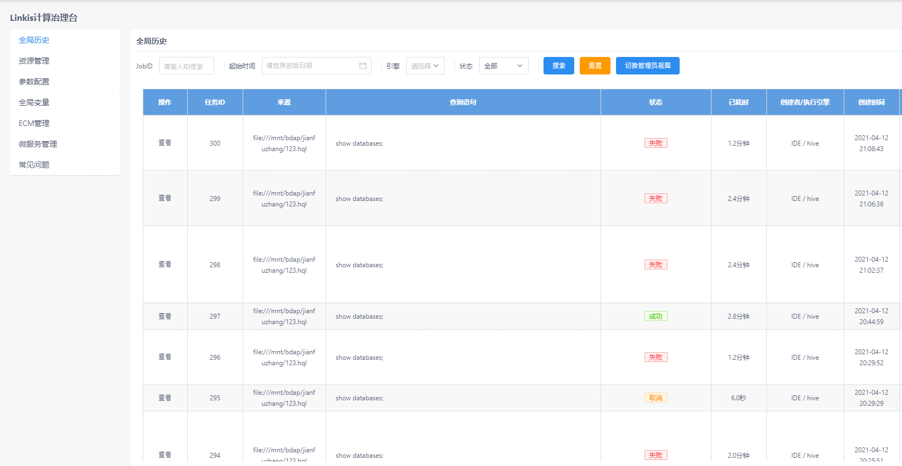
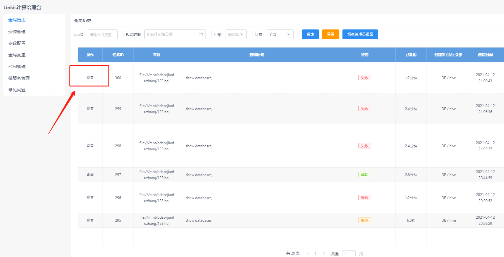
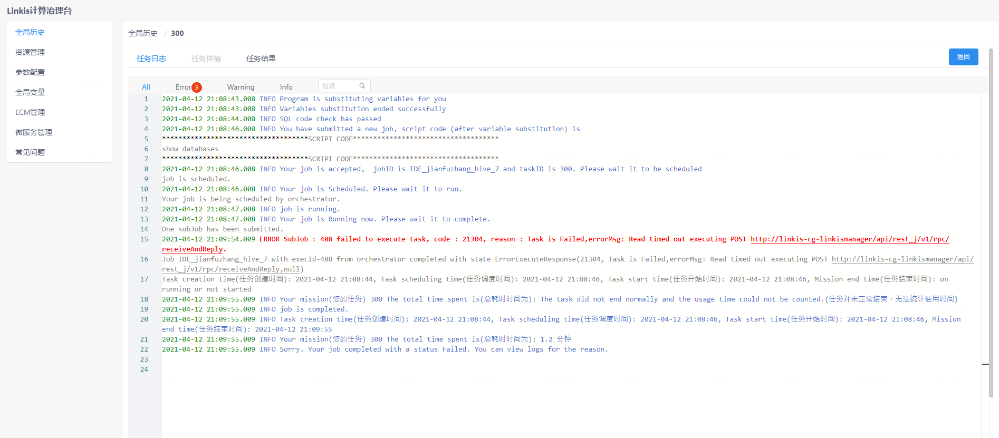
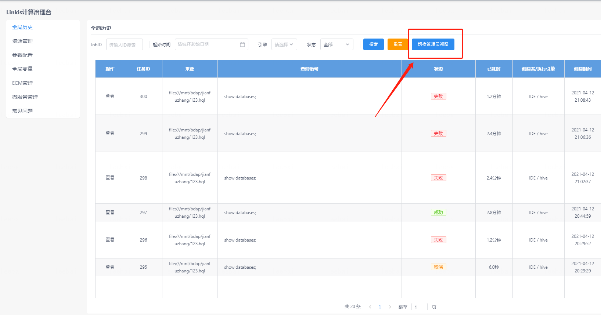

## 1. 历史任务

全局历史界面提供了用户自身的linkis任务提交记录，各个任务的创建时间、执行语句、状态都可以在此显示。并且可以根据任务ID、时间、引擎、状态等关键字过滤。

>   

## 2. 任务详情
点击左侧按钮可以查看任务执行日志、任务详情以及任务结果。任务执行失败可以通过任务日志排查问题。

## 3. 管理员视图
对于linkis计算治理台管理员来说，管理员可以通过点击页面的切换管理员视图查看所有用户的历史任务。

