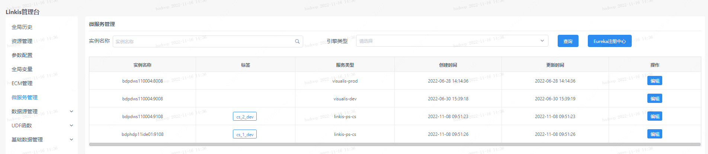
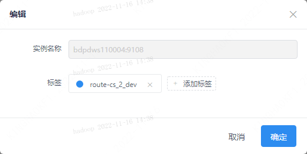
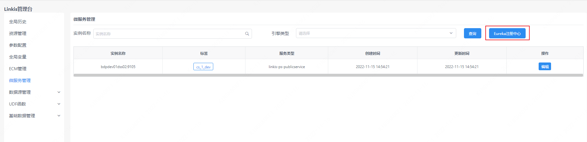
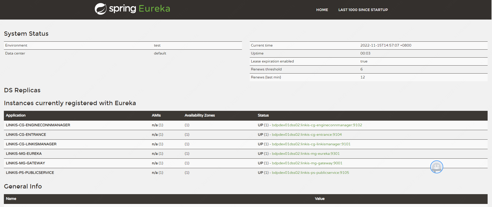

Linkis 是基于 Spring Cloud 构建的分布式微服务系统。注册中心服务使用的是 Eureka。微服务管理界面仅对管理员可见。

## 1. 服务查看

微服务管理界面可以查看 Linkis 下的所有微服务信息，可以通过实例名称，引擎类型关键字过滤服务。并且可以通过编辑按钮管理服务下的标签。

## 2. 注册中心

Linkis 自身的微服务可以点击Eureka注册中心查看，与 Linkis 关联的微服务会直接在该界面列出。

