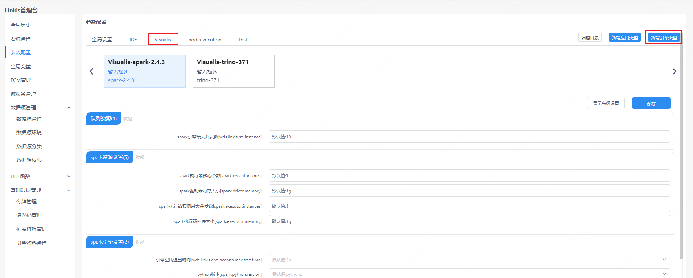
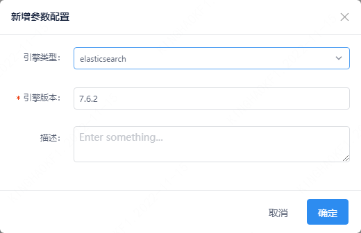
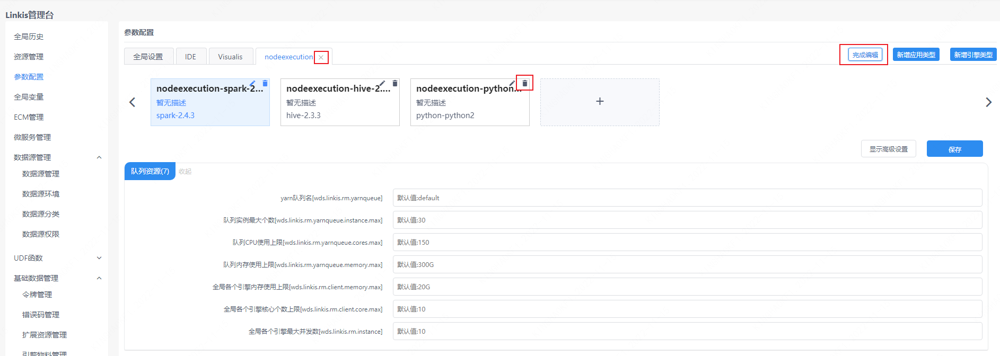
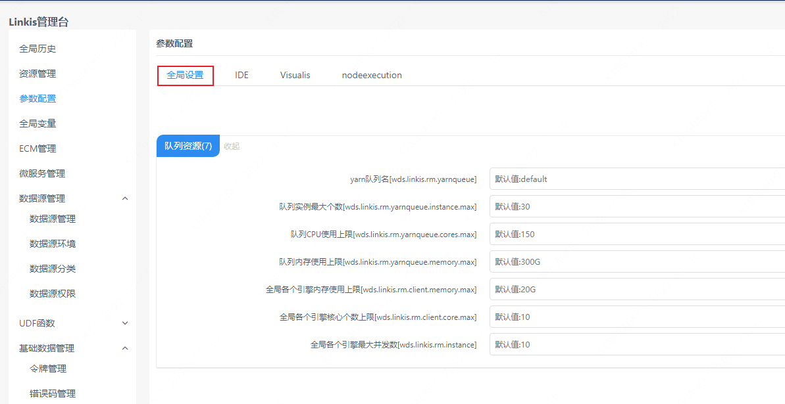
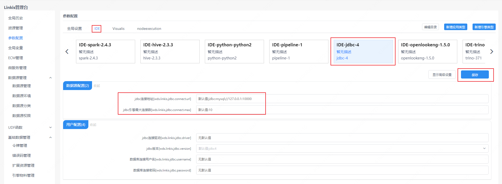

参数配置界面提供了用户自定义参数管理的功能，用户可以在该界面管理引擎的相关配置。默认提供了 `IDE`、`Visualis`、`nodeexecution` 应用的引擎配置，用户以可以根据需求增删应用和引擎。

## 1. 参数配置说明
参数配置页主要是对 `Linkis` 各引擎插件的参数进行管理。`Linkis` 中引擎配置是通过标签进行管理的，不同应用下的引擎配置参数是相互隔离的。对于未显示配置的引擎参数，执行任务时会调用系统初始化时默认引擎参数配置。

## 2. 新增应用（仅管理员）
管理员可以通过新增应用类型按钮，新增应用。

## 3. 新增引擎

引擎是跟应用相关联的，在新增引擎前必须先选中对应的引用，如在 `Visualis` 应用下新增引擎。

**注意：**引擎版本需要填写 [Linkis 支持的引擎版本](./overview.md)。否则执行 `Linkis` 任务时会报错。

## 4. 编辑应用和引擎（仅管理员）
管理员可以通过编辑目录按钮删除已有的应用和引擎配置（注意！直接删除应用会删除该应用下所有的引擎配置，并且不可恢复），或者添加引擎。

## 5. 全局设置

全局设置主要是对队列资源的参数进行配置，配置后对所有应用任务生效。

## 6. 引擎参数修改

用户点击对应应用下的引擎标签后，可以对引擎参数进行修改，如修改 `IDE` 应用下的 `JDBC` 引擎。修改完成后点击保存按钮。

