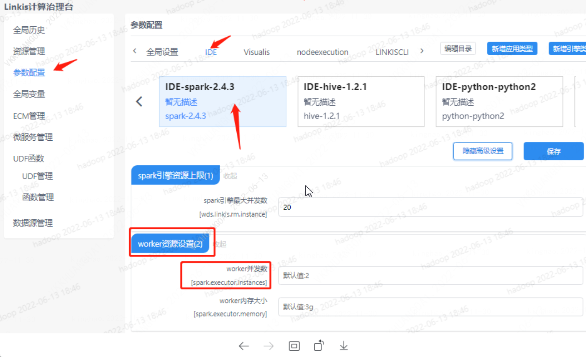
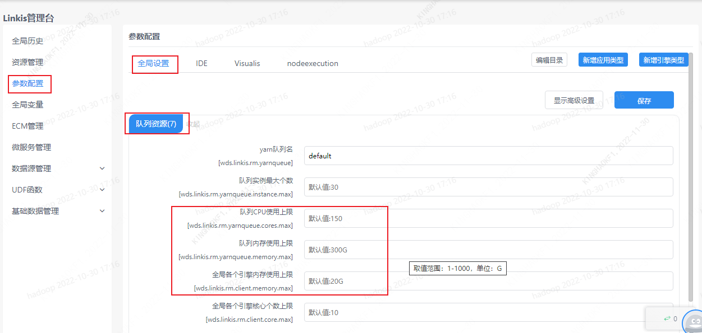
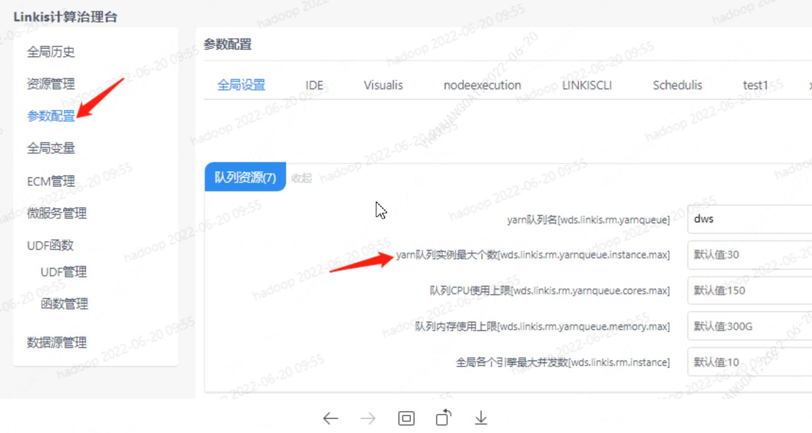
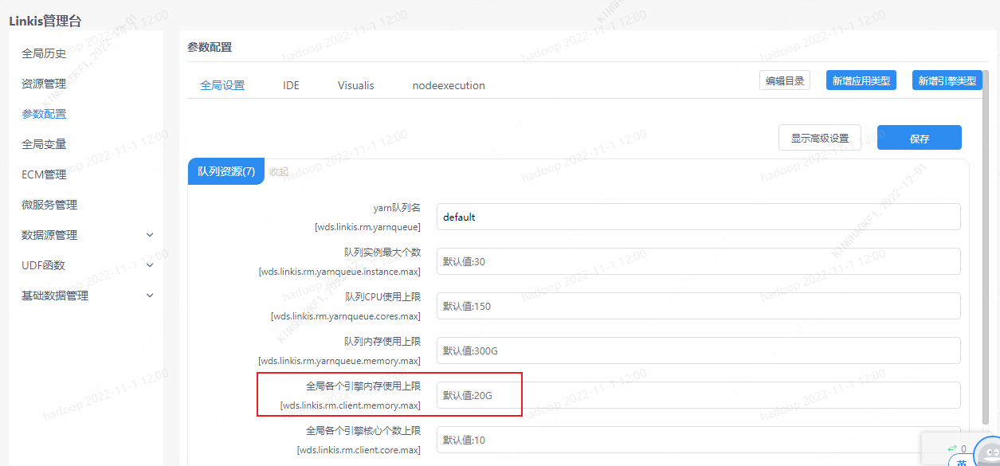
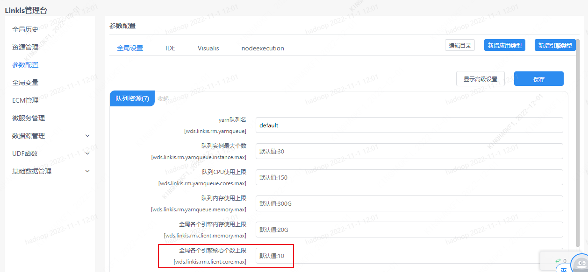
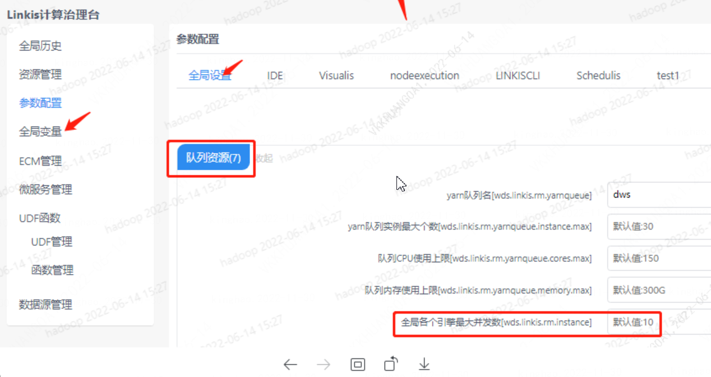
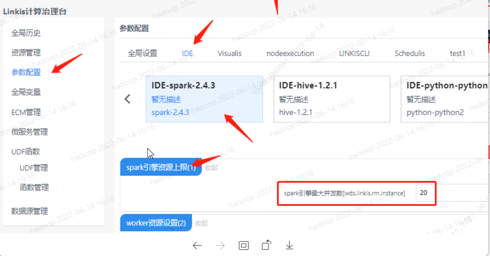
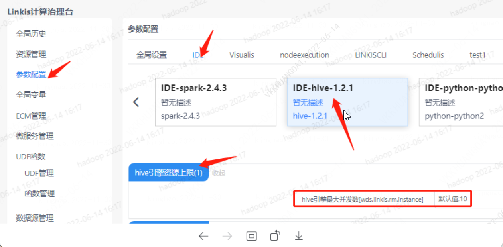

本文介绍对于内存、CPU等资源不足时如何进行参数调整。

## 1. 队列资源不足
任务执行过程中报错：错误码 12001，错误信息 队列CPU资源不足，可以调整Spark执行器个数

点击管理台--参数配置--IDE--Spark--显示高级设置--woker引擎资源设置(2)--调整执行器并发数

或者全局设置调整队列资源使用上限。

## 2. 队列实例数超过限制

任务执行过程中报错：错误码 12003，错误信息 队列实例数超过限制

点击管理台--参数配置--全局设置--队列资源--yarn队列实例最大个数[wds.linkis.rm.yarnqueue.instance.max]

## 3. 全局驱动器内存使用上限
任务执行过程中报错：错误码 12004，错误信息 全局驱动器内存使用上限，可以设置更低的驱动内存

点击管理台--参数配置--全局设置--队列资源--队列内存使用上限[wds.linkis.rm.yarnqueue.memory.max]

## 4. 超出全局驱动器CPU个数上限

任务执行过程中报错：错误码 12005，错误信息 超出全局驱动器CPU个数上限，可以清理空闲引擎

点击管理台--参数配置--全局设置--队列资源--全局各个引擎核心个数上限[wds.linkis.rm.client.core.max]

或者通过清理空闲引擎解决。

## 5. 超出引擎最大并发数上限

任务执行过程中报错：错误码 12006，错误信息 超出引擎最大并发数上限，可以清理空闲引擎

点击管理台--参数配置--全局设置--队列资源--全局各个引擎最大并发数[wds.linkis.rm.instance]

**Spark 引擎**

**Hive 引擎**

其他引擎设置类似 Spark 和 Hive 引擎。
