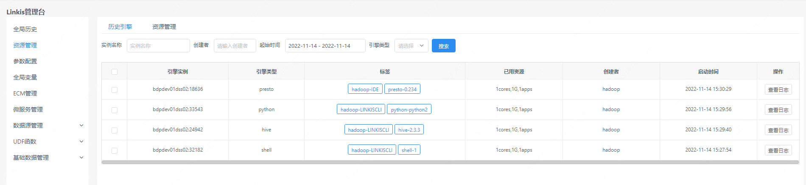
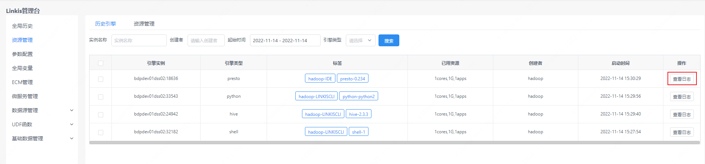
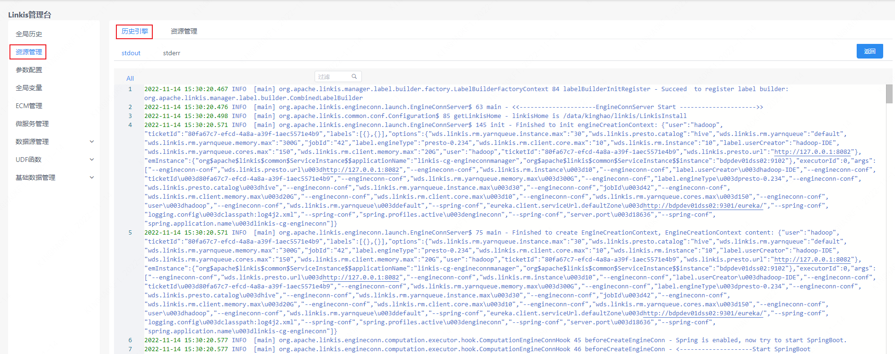
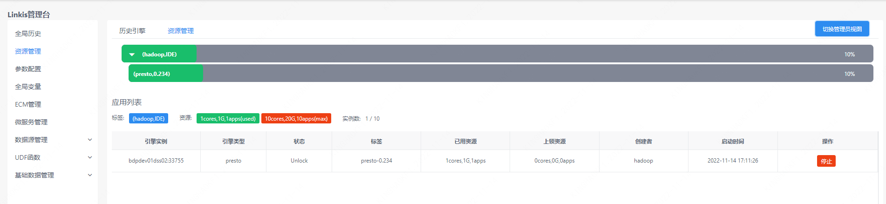
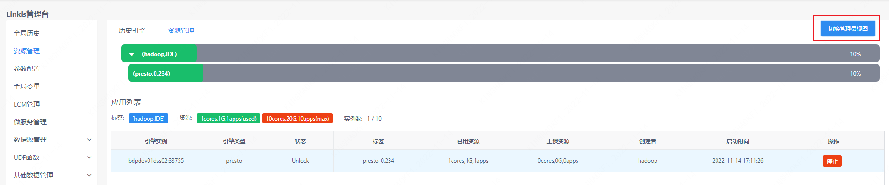
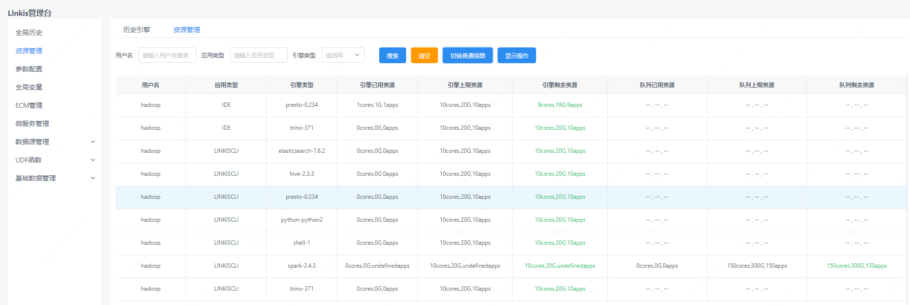

资源管理页面可以查看历史启动的引擎，以及对现有引擎资源状态进行管理。

## 1. 历史引擎

资源管理的历史引擎栏，用户可以看到自己当前已经启动的引擎状态，包括引擎类型、创建者、以及占用资源的情况。同时也可以根据实例名称、创建用户、引擎类型等关键字进行过滤。

## 2. 引擎日志
点击历史引擎右侧查看日志按钮可以查看引擎启动日志。如果引擎启动失败，也可以通过错误日志排查失败原因。

## 3. 资源管理
资源管理的历史引擎栏，用户可以看到自己当前启动的引擎状态，以及占用资源的情况，也能够通过页面停止引擎。

## 4. 管理员视图
对于linkis计算治理台管理员来说，可以通过点击资源管理页面的切换管理员视图查看所有用户的引擎资源。

