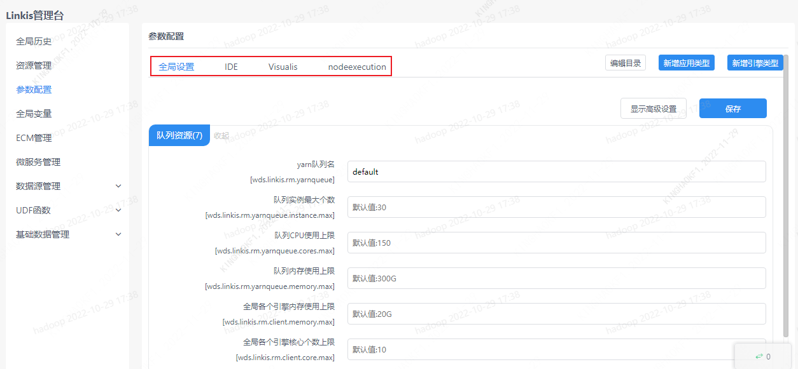
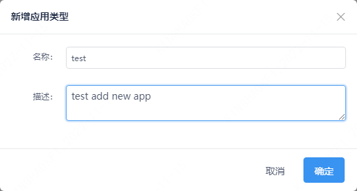
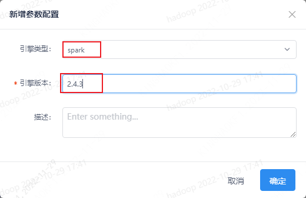

本文介绍如何对 Spark 引擎进行参数调整。

## 1. 查看或新增应用类型

Linkis 可以对不同应用中的引擎进行参数设置。用户可以根据需求创建应用。

## 2. 新增引擎
选择 Spark 引擎，填写正确的 引擎版本。
[查看 Linkis 支持的引擎版本](../../engine-usage/overview.md)

注意：新增引擎前，先选择对应的应用。

## 3. 调整引擎参数

新增 Spark 引擎后，点击 Spark 引擎会显示 Spark 可设置的参数。

