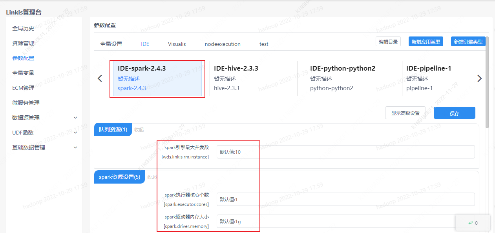
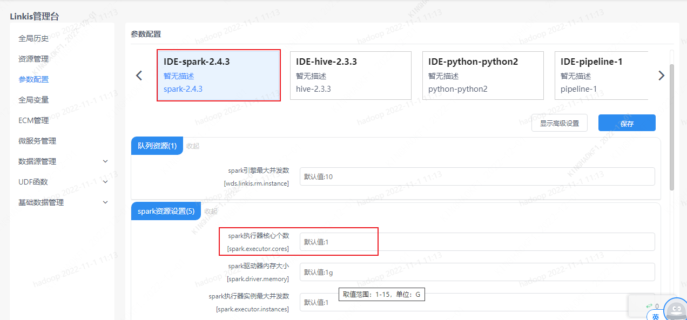
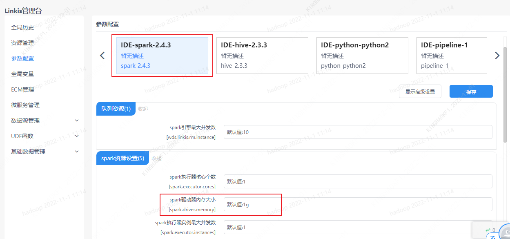

本文介绍如何对 Spark 引擎进行参数调整。

## 1. 调整引擎参数

用户可以根据需求在管理台调整 Spark 参数。Linkis 管理台 ==》 参数设置 ==》 选择相应应用 ==》 点击 Spark 引擎会显示 Spark 可设置的参数。

## 2. 增加引擎执行速度

如果想要引擎执行的更快，可以调整执行器个数，执行器核心个数越多执行效率越高。

## 3. Driver 处理大数据

如果需要拉取大数据再 Driver 处理，需要调整驱动内存参数。

