> Linkis1.0新增了计算治理台页面，可以提供给用户交互式的UI界面，用于查看Linkis任务的执行情况、自定义参数配置、引擎健康状态、资源剩余情况等等便于用户进行开发和管理的页面。

## 1. 管理台结构

计算治理台主要由以下几个功能页组成：

-   全局历史
-   资源管理
-   参数配置
-   全局变量
-   ECM管理](仅linkis计算治理台管理员可见)
-   微服务管理(仅linkis计算治理台管理员可见)

其中全局历史、资源管理、参数配置、全局变量是所有用户可见，而ECM管理和微服务管理仅仅对linkis计算治理台管理员可见。

Linkis计算治理台管理员可以通过linkis.properties中的下方参数配置：

`wds.linkis.governance.station.admin=hadoop (多位管理员用户名通过‘,’分隔)`

## 2. 全局历史
>   

全局历史界面提供了用户自身的linkis任务提交记录，各个任务的执行状态都可以在此显示，任务执行的失败原因也可以点击任务左侧的查看按钮查询

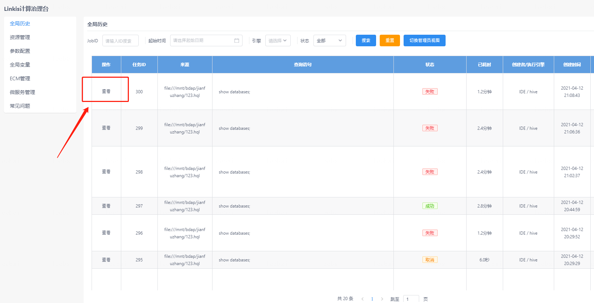

对于linkis计算治理台管理员来说，管理员可以通过点击页面的切换管理员视图查看所有用户的历史任务。

## 3. 资源管理

>   在资源管理界面，用户可以看到自己当前启动的引擎状态，以及占用资源的情况，也能够通过页面停止引擎。

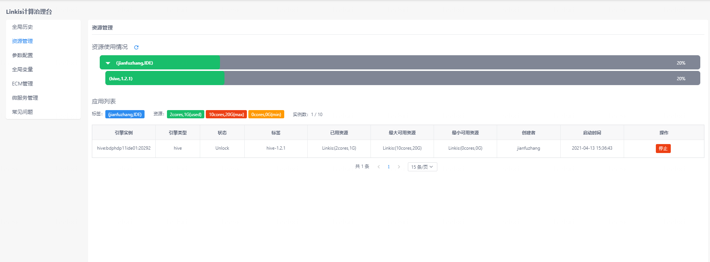

## 4. 参数配置

> 参数配置界面提供了用户自定义参数管理的功能，用户可以在该界面管理引擎的相关配置，管理员还能在这里新增应用类型和引擎。

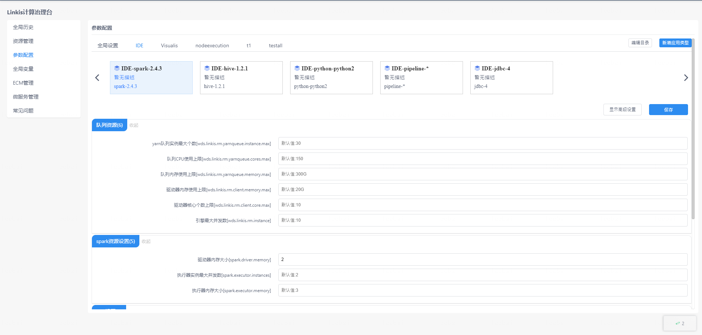

用户通过点击上方的应用类型，接着选择应用中拥有的引擎类型，即可展开该目录下的所有配置信息，修改配置信息点击保存即可生效。

编辑目录和新增应用类型仅管理员可见，点击编辑按钮可以删除已有的应用和引擎配置（注意！直接删除应用会删除该应用下所有的引擎配置，并且不可恢复），或者添加引擎，点击新增应用可以添加应用类型。

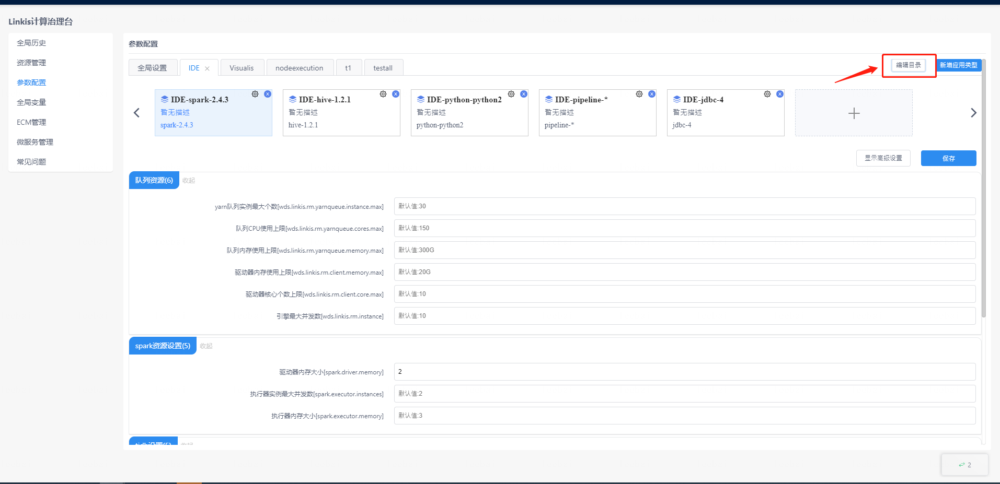

 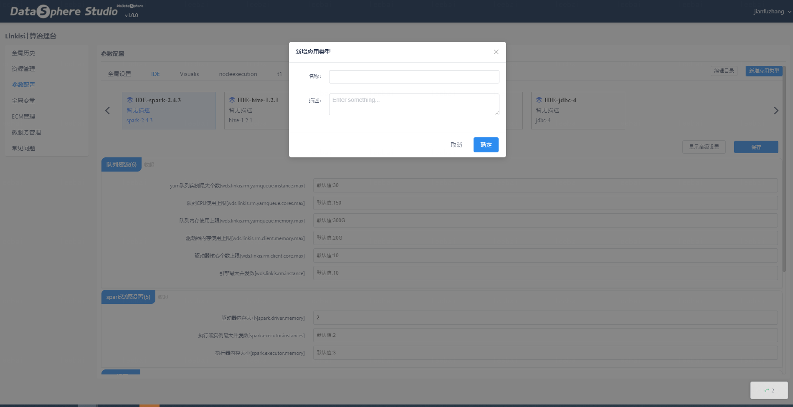

## 5. 全局变量

> 全局变量界面用户可以自定义变量用于代码编写，点击编辑按钮新增参数即可。

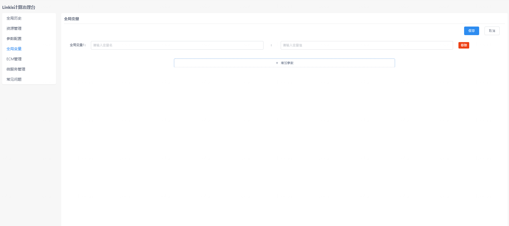

## 6. ECM管理
> **仅linkis计算治理台管理员可见**

ECM管理界面是用于管理员管理ECM和所有引擎的地方，该界面可以查看到ECM的状态信息、修改ECM标签信息、修改ECM状态信息以及查询各个ECM下的所有引擎信息。且仅管理员可见，管理员的配置方式可以在本文章第二大章节查看。

点击编辑按钮，可以编辑ECM的标签信息（仅允许编辑部分标签），以及修改ECM的状态。

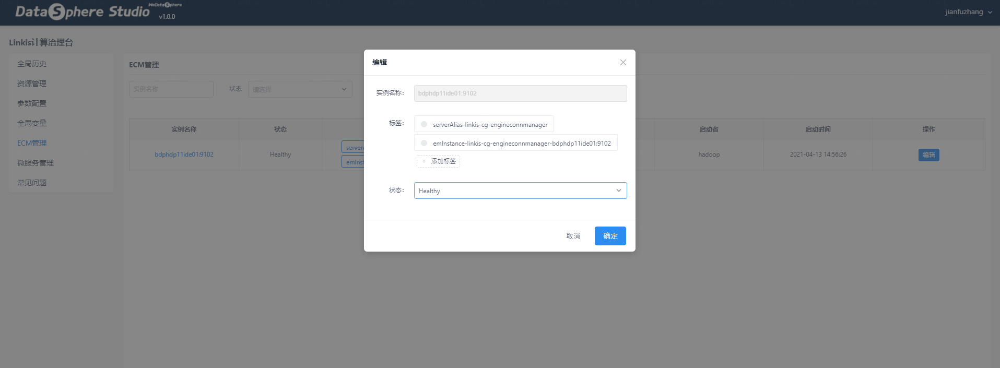

点击ECM的实例名称，可以查看该ECM下所有的引擎信息。

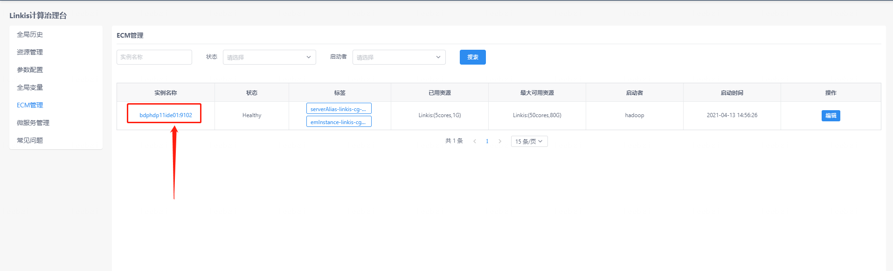

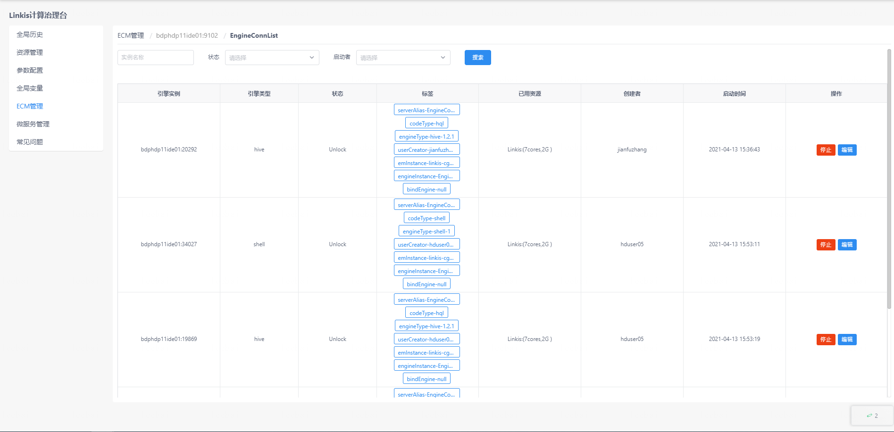

同样地，可以在该界面停止引擎，并且可以编辑引擎的标签信息。

## 7. 微服务管理

>**仅linkis计算治理台管理员可见**

微服务管理界面可以查看Linkis下的所有微服务信息，该界面也仅允许管理员可见。linkis自身的微服务可以点击Eureka注册中心查看，与linkis关联的微服务会直接在该界面列出。

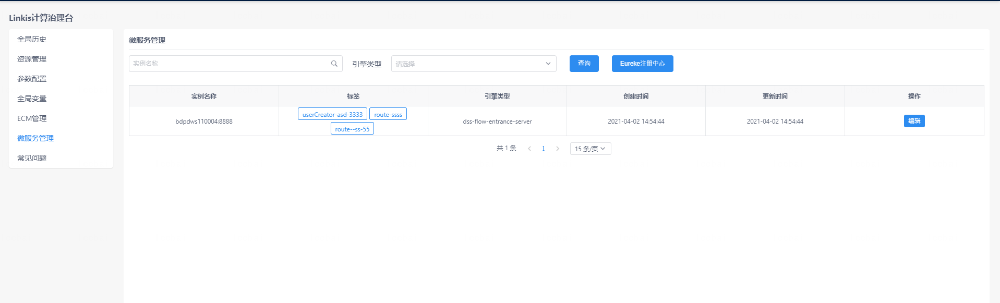

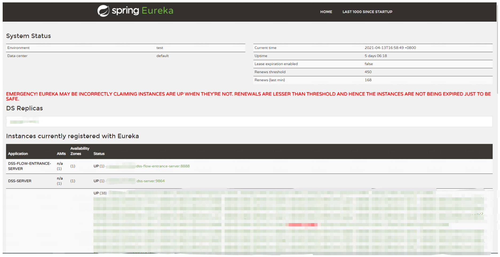

## 8. 管理台主要接口以及功能介绍
### 1 全局历史
#### 1.1 主要功能
- 执行任务的查询:支持根据时间/任务ID/引擎类型/任务状态查询历史任务。
- 运行态任务的强制停止
- 管理员用户可以切换管理员视图，查看所有的用户任务
- 查看任务详细执行日志以及执行结果

#### 1.2 主要接口

- 历史任务的分页查询 /api/rest_j/v1/jobhistory/list
- 历史任务的详细查询 /api/rest_j/v1/jobhistory/{taskId}/get
- 日志的查看 /api/rest_j/v1/filesystem/openLog?path=hdfs:%2F%2F%2Ftmp%2Flinkis%2Flog%2F2022-04-12%2FIDE%2Fhadoop%2F466.log
- 结果集文件列表 /api/rest_j/v1/filesystem/getDirFileTrees?path=hdfs:%2F%2F%2Ftmp%2Flinkis%2Fhadoop%2Flinkis%2F20220412_173302%2FIDE%2F466
- 执行结果集数据 /api/rest_j/v1/filesystem/openFile?path=hdfs:%2F%2F%2Ftmp%2Flinkis%2Fhadoop%2Flinkis%2F20220412_173302%2FIDE%2F466%2F_0.dolphin&page=1&pageSize=5000
- 任务的强制kill接口 /api/rest_j/v1/entrance/killJobs

### 2 资源管理
#### 2.1 主要功能
- 查看登录用户当前启动的引擎状态，占用资源情况
- 能够通过界面操作停止引擎
- 管理员用户可以切换管理员视图，查看yarn队列资源，以及资源重置

#### 2.2 主要接口
- 资源查询接口 /api/rest_j/v1/linkisManager/rm/userresources
- 详细的资源使用的引擎实例信息 api/rest_j/v1/linkisManager/rm/applicationlist
- 引擎停止接口 /api/rest_j/v1/linkisManager/rm/enginekill
- 资源重置接口 /api/rest_j/v1/linkisManager/rm/resetResource?resourceId=2
- 所有使用资源列表 /api/rest_j/v1/linkisManager/rm/allUserResource?page=1&size=15

### 3 参数配置
#### 3.1 主要功能
- 用户自定义参数管理的功能
- 用户可以在该界面管理引擎的相关配置
- 管理员还能在这里新增应用类型和引擎

#### 3.2 主要接口
- 查看配置的树形列表 /api/rest_j/v1/configuration/getFullTreesByAppName?creator=%E5%85%A8%E5%B1%80%E8%AE%BE%E7%BD%AE
- 新建二级引擎配置 /api/rest_j/v1/configuration/createSecondCategory
- 配置的保存/api/rest_j/v1/configuration/saveFullTree

### 4 全局变量
#### 4.1 主要功能
- 支持用户可以自定义变量的新增和修改，在任务提交时能够根据配置的变量值进行自动替换。能够进行常用变量的复用

#### 4.2 主要接口
- 全局变量的保存 /api/rest_j/v1/variable/saveGlobalVariable
- 全局变量的查询 /api/rest_j/v1/variable/listGlobalVariable

### 5 ECM管理
> **仅linkis计算治理台管理员可见**
#### 5.1 主要功能
- 管理员可以管理ECM和所有引擎，
- 可以查看到ECM的状态信息、修改ECM标签信息、修改ECM状态信息以及查询各个ECM下的所有引擎信息
- 可以编辑ECM的标签信息（仅允许编辑部分标签），以及修改ECM的状态。
- 可以查看该ECM下所有的引擎信息，以及可以针对单个引擎进行的停止操作，查看运行日志，并且可以编辑引擎的标签信息。

最大可用资源通过配置文件参数配置 默认值
wds.linkis.ecm.memory.max 100g
wds.linkis.ecm.cores.max 100
wds.linkis.ecm.engineconn.instances.max 50

#### 5.2 主要接口
- 查询ECM列表 api/rest_j/v1/linkisManager/listAllEMs
- 修改ECM信息 api/rest_j/v1/linkisManager/modifyEMInfo
- 查询ecm下的引擎数据 /api/rest_j/v1/linkisManager/listEMEngines
- 修改引擎信息 api/rest_j/v1/linkisManager/modifyEngineInfo
- 引擎停止接口 /api/rest_j/v1/linkisManager/rm/enginekill
- 引擎日志查询接口 /api/rest_j/v1/linkisManager/openEngineLog

### 6 微服务管理

#### 6.1 主要功能

可以查看Linkis下的所有微服务信息，仅linkis计算治理台管理员可见。

#### 6.2 主要接口
- 服务查询 /api/rest_j/v1/microservice/allInstance
- label的更新 api/rest_j/v1/microservice/instanceLabel

