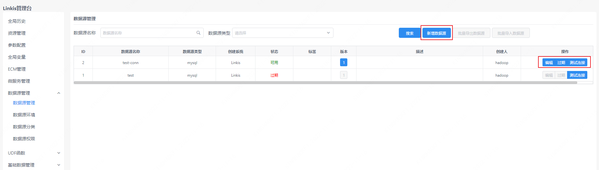
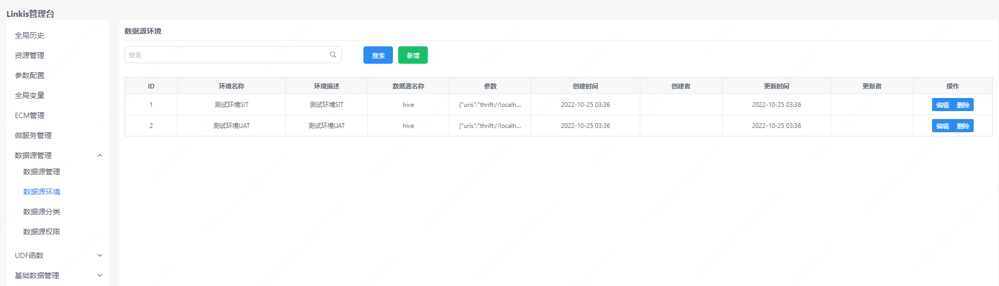
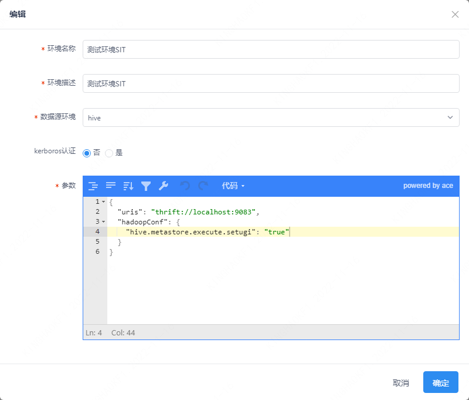
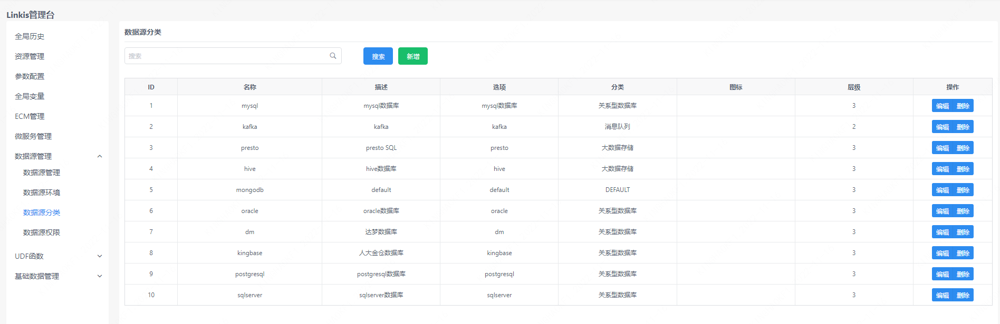
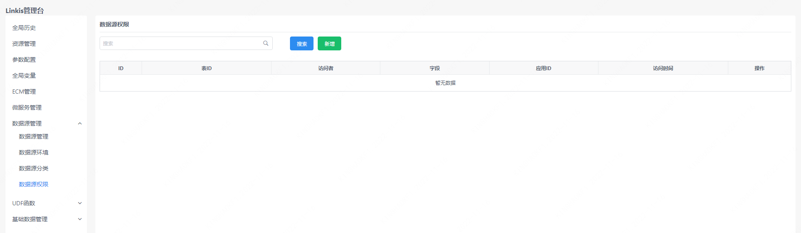

数据源管理可以对数据源链接信息、数据源环境、数据源分类以及数据源权限进行处理。

## 1. 数据源管理

数据源管理界面可以查看 Linkis 管理的数据源。并对数据源进行管理，包括创建、修改、测试连接、修改数据源状态等。

## 2. 数据源环境

数据源环境页面可以查看数据源环境，并且可以修改所管理环境的参数。

## 3. 数据源分类

数据源分类页面用于管理数据源的类型，该分类在数据源管理、数据源权限页面都有使用。

## 4. 数据源权限

该页面对数据源权限进行管理。

