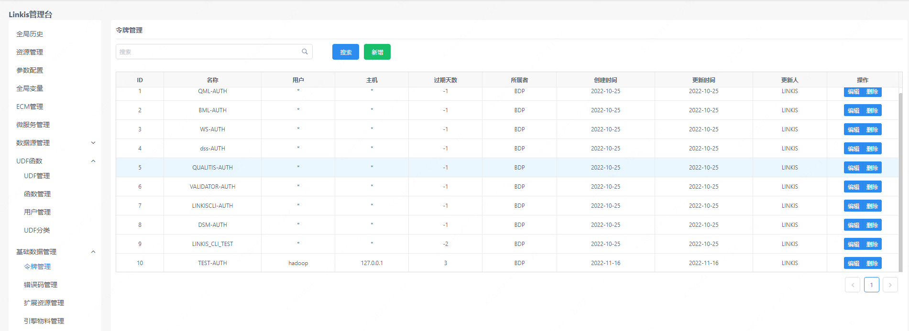
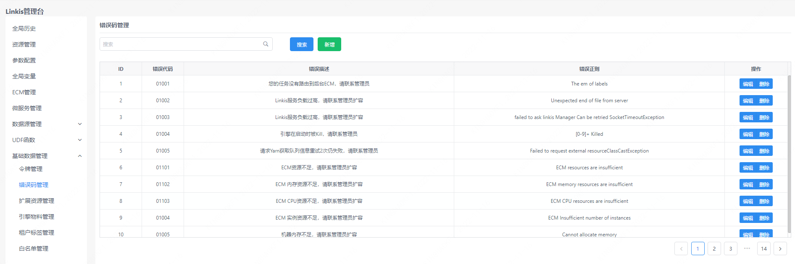
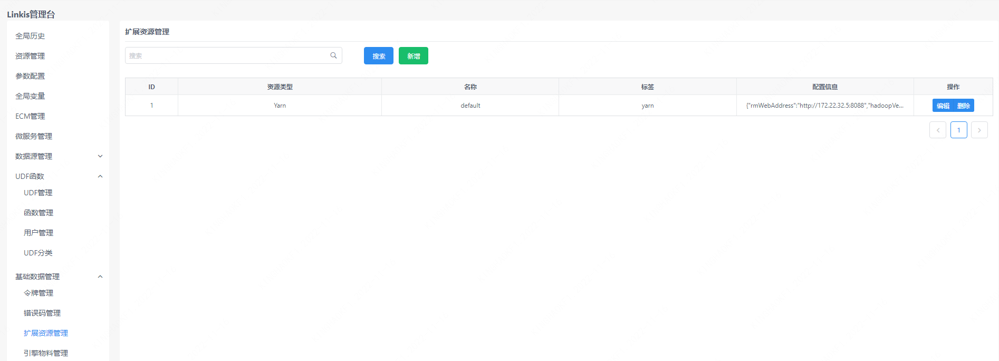
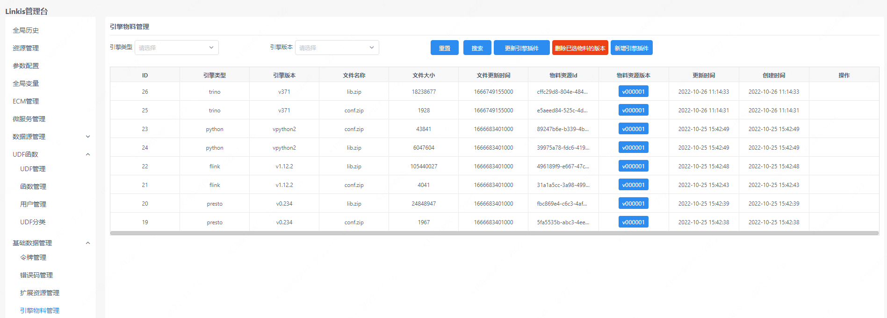

数据源管理页面可以对用户令牌、错误码、扩展资源、引擎物料等数据进行管理。

## 1. 令牌管理

用于管理各应用 Token 信息。

## 2. 错误码管理

### 2.1 错误码列表

列出错误码信息，可以根据错误码或错误描述进行查询。

### 2.1 常见错误码问题解决

[常见错误码及处理方法](../../tuning-and-troubleshooting/error-guide/error-code.md)

## 3. 扩展资源管理

用于管理扩展资源，例如 yarn 链接 url 等。

## 4. 引擎物料管理

用于管理 Linkis 引擎物料，包括引擎插件的创建、更新以及删除。

