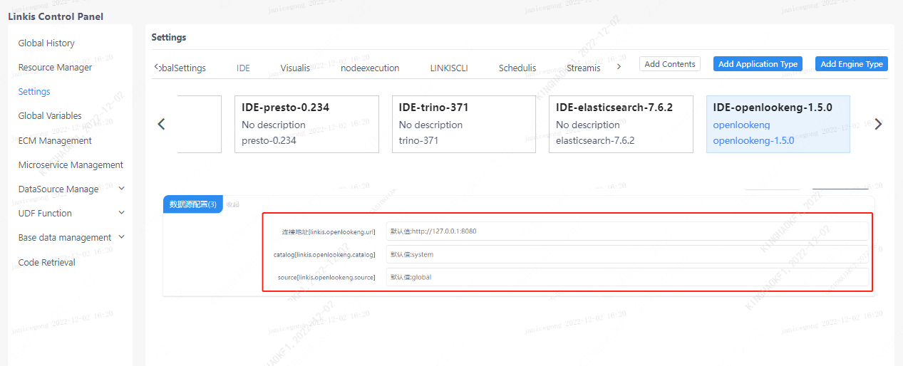

This article mainly introduces the installation, usage and configuration of the openLooKeng engine plugin in `Linkis` `.

## 1. Environmental Requirements

### 1.1 Environment Installation

If you wish to deploy the `openLooKeng` engine, you need to prepare a working `openLooKeng` environment.

### 1.2 Service Authentication

```shell
# Prepare hetu-cli
wget https://download.openlookeng.io/1.5.0/hetu-cli-1.5.0-executable.jar
mv hetu-cli-1.5.0-executable.jar hetu-cli
chmod +x hetu-cli

# link service
./hetu-cli --server 172.22.32.6:9090 --catalog tpcds --schema default

# Execute query statement
lk:default> select d_date_sk, d_date_id, d_date, d_month_seq from tpcds.sf1.date_dim order by d_date limit 5;

# Get the following output to represent the service is available
 d_date_sk |    d_date_id     |   d_date   | d_month_seq
-------------+--------+------------+------ -------
   2415022 | AAAAAAAAOKJNECAA | 1900-01-02 | 0
   2415023 | AAAAAAAAPKJNECAA | 1900-01-03 | 0
   2415024 | AAAAAAAAALJNECAA | 1900-01-04 | 0
   2415025 | AAAAAAAABLJNECAA | 1900-01-05 | 0
   2415026 | AAAAAAAACLJNECAA | 1900-01-06 | 0
(5 rows)

Query 20221110_043803_00011_m9gmv, FINISHED, 1 node
Splits: 33 total, 33 done (100.00%)
0:00 [73K rows, 0B] [86.8K rows/s, 0B/s]
```

## 2. Engine plugin installation

### 2.1 Engine plugin preparation (choose one) [non-default engine](./overview.md)

Method 1: Download the engine plug-in package directly

[Linkis Engine Plugin Download](https://linkis.apache.org/zh-CN/blog/2022/04/15/how-to-download-engineconn-plugin)

Method 2: Compile the engine plug-in separately (requires a `maven` environment)

```
# compile
${linkis_code_dir}/linkis-enginepconn-pugins/engineconn-plugins/openlookeng/
mvn clean install
# The compiled engine plug-in package is located in the following directory
${linkis_code_dir}/linkis-engineconn-plugins/openlookeng/target/out/
```
[EngineConnPlugin Engine Plugin Installation](../deployment/install-engineconn.md)

### 2.2 Upload and load engine plugins

Upload the engine plug-in package in 2.1 to the engine directory of the server
```bash 
${LINKIS_HOME}/lib/linkis-engineplugins
```
The directory structure after uploading is as follows
```
linkis-engineconn-plugins/
├── openlookeng
│   ├── dist
│ │ └── v1.5.0
│   │       ├── conf
│ │ └── lib
│   └── plugin
│ └── 1.5.0
```

### 2.3 Engine refresh

#### 2.3.1 Restart and refresh
Refresh the engine by restarting the `linkis-cg-linkismanager` service
```bash
cd ${LINKIS_HOME}/sbin
sh linkis-daemon.sh restart cg-linkismanager
```

### 2.3.2 Check whether the engine is refreshed successfully
You can check whether the `last_update_time` of the `linkis_engine_conn_plugin_bml_resources` table in the database is the time to trigger the refresh.

```sql
#Login to the `linkis` database
select * from linkis_cg_engine_conn_plugin_bml_resources;
```

## 3. The use of the engine

### 3.1 Submitting tasks via `Linkis-cli`

```shell
sh ./bin/linkis-cli -engineType openlookeng-1.5.0 \
-codeType sql -code 'select * from tpcds.sf1.date_dim;' \
-submitUser hadoop -proxyUser hadoop \
-runtimeMap linkis.openlookeng.url=http://127.0.0.1:8080
```

More `Linkis-Cli` command parameter reference: [Linkis-Cli usage](../user-guide/linkiscli-manual.md)

### 3.2 Submitting tasks through `Linkis SDK`

`Linkis` provides `SDK` of `Java` and `Scala` to submit tasks to `Linkis` server. For details, please refer to [JAVA SDK Manual](../user-guide/sdk-manual.md).
For `JDBC` tasks you only need to modify the `EngineConnType` and `CodeType` parameters in `Demo`:

```java
Map<String, Object> labels = new HashMap<String, Object>();
labels.put(LabelKeyConstant.ENGINE_TYPE_KEY, "openlookeng-1.5.0"); // required engineType Label
labels.put(LabelKeyConstant.USER_CREATOR_TYPE_KEY, "hadoop-IDE");// required execute user and creator
labels.put(LabelKeyConstant.CODE_TYPE_KEY, "sql"); // required codeType
```

## 4. Engine configuration instructions

### 4.1 Default Configuration Description
| Configuration | Default | Required | Description |
| ------------------------ | ------------------- | ---| ------------------------------------------- |
| linkis.openlookeng.url | http://127.0.0.1:8080 | yes | link address |
| linkis.openlookeng.catalog | system | yes | catalog |
| linkis.openlookeng.source | global | no | source |

### 4.2 Configuration modification
If the default parameters are not satisfied, there are the following ways to configure some basic parameters

#### 4.2.1 Management console configuration



Note: After modifying the configuration under the IDE label, you need to specify -creator IDE to take effect (other labels are similar), such as:

```shell
sh ./bin/linkis-cli -creator IDE \
-engineType openlookeng-1.5.0 -codeType sql \
-code 'select * from tpcds.sf1.date_dim;' \
-submitUser hadoop -proxyUser hadoop 
```

#### 4.2.2 Task interface configuration
Submit the task interface, configure it through the parameter `params.configuration.runtime`

```shell
Example of http request parameters
{
    "executionContent": {"code": "select * from tpcds.sf1.date_dim;", "runType":  "sql"},
    "params": {
                    "variable": {},
                    "configuration": {
                            "runtime": {
                                "linkis.openlookeng.url":"http://127.0.0.1:9090"
                                }
                            }
                    },
    "labels": {
        "engineType": "openlookeng-1.5.0",
        "userCreator": "hadoop-IDE"
    }
}
```

### 4.3 Engine related data sheet

`Linkis` is managed through the engine tag, and the data table information involved is shown below.

```
linkis_ps_configuration_config_key: key and default values ​​of configuration parameters inserted into the engine
linkis_cg_manager_label: insert engine label such as: openlookeng-1.5.0
linkis_ps_configuration_category: Insert the directory association of the engine
linkis_ps_configuration_config_value: Insert the configuration that the engine needs to display
linkis_ps_configuration_key_engine_relation: The relationship between the configuration item and the engine
```

The initial data related to the engine in the table is as follows

```sql
-- set variable
SET @OPENLOOKENG_LABEL="openlookeng-1.5.0";
SET @OPENLOOKENG_ALL=CONCAT('*-*,',@OPENLOOKENG_LABEL);
SET @OPENLOOKENG_IDE=CONCAT('*-IDE,',@OPENLOOKENG_LABEL);

-- engine label
insert into `linkis_cg_manager_label` (`label_key`, `label_value`, `label_feature`, `label_value_size`, `update_time`, `create_time`) VALUES ('combined_userCreator_engineType', @OPENLOOKENG_ALL, 'OPTIONAL', 2, now(), now());
insert into `linkis_cg_manager_label` (`label_key`, `label_value`, `label_feature`, `label_value_size`, `update_time`, `create_time`) VALUES ('combined_userCreator_engineType', @OPENLOOKENG_IDE, 'OPTIONAL', 2, now(), now());

select @label_id := id from linkis_cg_manager_label where `label_value` = @OPENLOOKENG_IDE;
insert into linkis_ps_configuration_category (`label_id`, `level`) VALUES (@label_id, 2);

-- configuration key
INSERT INTO `linkis_ps_configuration_config_key` (`key`, `description`, `name`, `default_value`, `validate_type`, `validate_range`, `engine_conn_type`, `is_hidden`, `is_advanced`, `level`, `treeName`) VALUES ('linkis.openlookeng.url', 'eg: http://127.0.0.1:8080', 'connection address', 'http://127.0.0.1:8080', 'Regex', '^\\s *http://([^:]+)(:\\d+)(/[^\\?]+)?(\\?\\S*)?$', 'openlookeng', 0, 0, 1, 'data source conf');
INSERT INTO `linkis_ps_configuration_config_key` (`key`, `description`, `name`, `default_value`, `validate_type`, `validate_range`, `engine_conn_type`, `is_hidden`, `is_advanced`, `level`, `treeName`) VALUES ('linkis.openlookeng.catalog', 'catalog', 'catalog', 'system', 'None', '', 'openlookeng', 0, 0, 1, 'data source conf');
INSERT INTO `linkis_ps_configuration_config_key` (`key`, `description`, `name`, `default_value`, `validate_type`, `validate_range`, `engine_conn_type`, `is_hidden`, `is_advanced`, `level`, `treeName`) VALUES ('linkis.openlookeng.source', 'source', 'source', 'global', 'None', '', 'openlookeng', 0, 0, 1, 'data source conf');

-- key engine relation
insert into `linkis_ps_configuration_key_engine_relation` (`config_key_id`, `engine_type_label_id`)
(select config.id as `config_key_id`, label.id AS `engine_type_label_id` FROM linkis_ps_configuration_config_key config
INNER JOIN linkis_cg_manager_label label ON config.engine_conn_type = 'openlookeng' and label_value = @OPENLOOKENG_ALL);

-- openlookeng default configuration
insert into `linkis_ps_configuration_config_value` (`config_key_id`, `config_value`, `config_label_id`)
(select `relation`.`config_key_id` AS `config_key_id`, '' AS `config_value`, `relation`.`engine_type_label_id` AS `config_label_id` FROM linkis_ps_configuration_key_engine_relation relation
INNER JOIN linkis_cg_manager_label label ON relation.engine_type_label_id = label.id AND label.label_value = @OPENLOOKENG_ALL);

```
