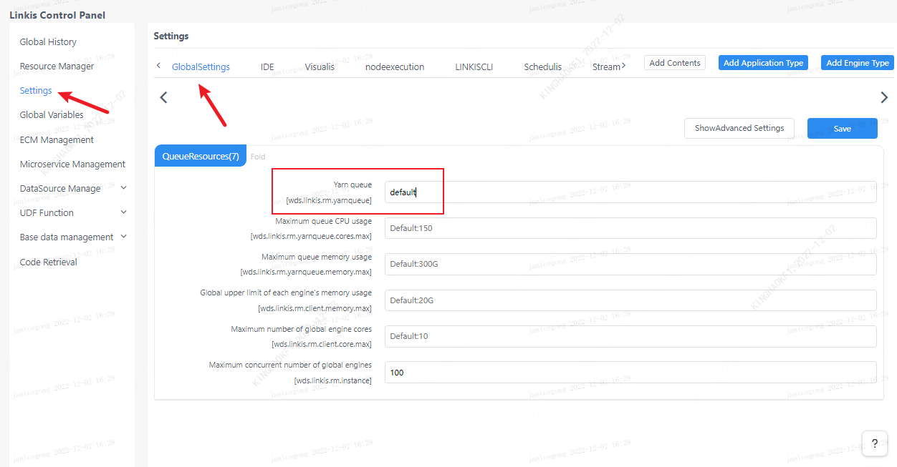

This article mainly introduces the installation, use and configuration of the `Spark` engine plugin in `Linkis`.

## 1. Preliminary work
### 1.1 Engine installation

If you wish to use the `spark` engine on your server, you need to ensure that the following environment variables are set correctly and that the engine's starting user has these environment variables.

It is strongly recommended that you check these environment variables for the executing user before executing a `spark` job.

| Environment variable name | Environment variable content | Remarks |
|-----------------|----------------|-------------- -----------------------------|
| JAVA_HOME | JDK installation path | Required |
| HADOOP_HOME | Hadoop installation path | Required |
| HADOOP_CONF_DIR | Hadoop configuration path | required |
| HIVE_CONF_DIR | Hive configuration path | required |
| SPARK_HOME | Spark installation path | Required |
| SPARK_CONF_DIR | Spark configuration path | Required |
| python | python | It is recommended to use anaconda's python as the default python |

### 1.2 Environment verification
Verify that `Spark` is successfully installed by `pyspark`
```
pyspark

#After entering the pyspark virtual environment, the spark logo appears, indicating that the environment is successfully installed
Welcome to
      ______
     /__/__ ___ _____/ /__
    _\ \/ _ \/ _ `/ __/ '_/
   /__ / .__/\_,_/_/ /_/\_\   version 2.4.3
      /_/

Using Python version 2.7.13 (default, Sep 30 2017 18:12:43)
SparkSession available as 'spark'.
```

## 2. Engine plugin installation [default engine](./overview.md)

The `Spark` engine plugin is included in the binary installation package released by `linkis` by default, and users do not need to install it additionally.

In theory `Linkis` supports all versions of `spark2.x` and above. The default supported version is `Spark2.4.3`. If you want to use another version of `spark`, such as `spark2.1.0`, you just need to modify the version of the plugin `spark` and compile it. Specifically, you can find the `linkis-engineplugin-spark` module, change the value of the `<spark.version>` tag in the `maven` dependency to 2.1.0, and then compile this module separately.

[EngineConnPlugin engine plugin installation](../deployment/install-engineconn.md)

## 3. Using the `spark` engine

### 3.1 Submitting tasks via `Linkis-cli`

```shell
# codeType correspondence py-->pyspark sql-->sparkSQL scala-->Spark scala
sh ./bin/linkis-cli -engineType spark-2.4.3 -codeType sql -code "show databases"  -submitUser hadoop -proxyUser hadoop

# You can specify the yarn queue in the submission parameter by -confMap wds.linkis.yarnqueue=dws
sh ./bin/linkis-cli -engineType spark-2.4.3 -codeType sql  -confMap wds.linkis.yarnqueue=dws -code "show databases"  -submitUser hadoop -proxyUser hadoop
```
More `Linkis-Cli` command parameter reference: [Linkis-Cli usage](../user-guide/linkiscli-manual.md)

### 3.2 Submitting tasks through `Linkis SDK`

`Linkis` provides `SDK` of `Java` and `Scala` to submit tasks to `Linkis` server. For details, please refer to [JAVA SDK Manual](../user-guide/sdk-manual.md).
For `Spark` tasks you only need to modify the `EngineConnType` and `CodeType` parameters in `Demo`:

```java
Map<String, Object> labels = new HashMap<String, Object>();
labels.put(LabelKeyConstant.ENGINE_TYPE_KEY, "spark-2.4.3"); // required engineType Label
labels.put(LabelKeyConstant.USER_CREATOR_TYPE_KEY, "hadoop-IDE");// required execute user and creator
labels.put(LabelKeyConstant.CODE_TYPE_KEY, "sql"); // required codeType py,sql,scala
```

## 4. Engine configuration instructions

### 4.1 Default Configuration Description
| Configuration | Default | Required | Description |
| ------------------------ | ------------------- | ---| ------------------------------------------- |
| wds.linkis.rm.instance | 10 |No| Maximum number of concurrent engines |
| spark.executor.cores | 1 |No| Number of spark executor cores |
| spark.driver.memory | 1g | no | maximum concurrent number of spark executor instances |
| spark.executor.memory | 1g | No | spark executor memory size |
| wds.linkis.engineconn.max.free.time | 1h | No | Engine idle exit time |
| spark.python.version | python2 | no | python version |

### 4.2 Queue resource configuration
Because the execution of `spark` requires queue resources, you need to set up a queue that you can execute.    

 


### 4.3 Configuration modification
If the default parameters are not satisfied, there are the following ways to configure some basic parameters

#### 4.3.1 Management Console Configuration
Users can customize settings, such as the number of `spark` sessions `executor` and `executor` memory. These parameters are for users to set their own `spark` parameters more freely, and other `spark` parameters can also be modified, such as the `python` version of `pyspark`, etc.


Note: After modifying the configuration under the `IDE` tag, you need to specify `-creator IDE` to take effect (other tags are similar), such as:

```shell
sh ./bin/linkis-cli -creator IDE \
-engineType spark-2.4.3 -codeType sql \
-code "show databases"  \
-submitUser hadoop -proxyUser hadoop
```

#### 4.3.2 Task interface configuration
Submit the task interface, configure it through the parameter `params.configuration.runtime`

```shell
Example of http request parameters
{
    "executionContent": {"code": "show databases;", "runType":  "sql"},
    "params": {
                    "variable": {},
                    "configuration": {
                            "runtime": {
                                "wds.linkis.rm.instance":"10"
                                }
                            }
                    },
    "labels": {
        "engineType": "spark-2.4.3",
        "userCreator": "hadoop-IDE"
    }
}
```

### 4.4 Engine related data sheet

`Linkis` is managed through the engine tag, and the data table information involved is shown below.

```
linkis_ps_configuration_config_key: Insert the key and default values ​​​​of the configuration parameters of the engine
linkis_cg_manager_label: insert engine label such as: spark-2.4.3
linkis_ps_configuration_category: The directory association relationship of the insertion engine
linkis_ps_configuration_config_value: The configuration that the insertion engine needs to display
linkis_ps_configuration_key_engine_relation: The relationship between the configuration item and the engine
```

The initial data in the table related to the `spark` engine is as follows

```sql
-- set variable
SET @SPARK_LABEL="spark-2.4.3";
SET @SPARK_ALL=CONCAT('*-*,',@SPARK_LABEL);
SET @SPARK_IDE=CONCAT('*-IDE,',@SPARK_LABEL);

-- engine label
insert into `linkis_cg_manager_label` (`label_key`, `label_value`, `label_feature`, `label_value_size`, `update_time`, `create_time`) VALUES ('combined_userCreator_engineType', @SPARK_ALL, 'OPTIONAL', 2, now(), now());
insert into `linkis_cg_manager_label` (`label_key`, `label_value`, `label_feature`, `label_value_size`, `update_time`, `create_time`) VALUES ('combined_userCreator_engineType', @SPARK_IDE, 'OPTIONAL', 2, now(), now());

select @label_id := id from linkis_cg_manager_label where `label_value` = @SPARK_IDE;
insert into linkis_ps_configuration_category (`label_id`, `level`) VALUES (@label_id, 2);

-- configuration key
INSERT INTO `linkis_ps_configuration_config_key` (`key`, `description`, `name`, `default_value`, `validate_type`, `validate_range`, `is_hidden`, `is_advanced`, `level`, `treeName`, `engine_conn_type`) VALUES ('wds.linkis.rm.instance', 'Range: 1-20, unit: each', 'Maximum concurrent number of spark engine', '10', 'NumInterval', '[1,20]', '0 ', '0', '1', 'queue resources', 'spark');
INSERT INTO `linkis_ps_configuration_config_key` (`key`, `description`, `name`, `default_value`, `validate_type`, `validate_range`, `is_hidden`, `is_advanced`, `level`, `treeName`, `engine_conn_type`) VALUES ('spark.executor.instances', 'value range: 1-40, unit: individual', 'maximum concurrent number of spark executor instances', '1', 'NumInterval', '[1,40]', '0', '0', '2', 'spark resource settings', 'spark');
INSERT INTO `linkis_ps_configuration_config_key` (`key`, `description`, `name`, `default_value`, `validate_type`, `validate_range`, `is_hidden`, `is_advanced`, `level`, `treeName`, `engine_conn_type`) VALUES ('spark.executor.cores', 'Value range: 1-8, unit: number', 'Number of spark executor cores', '1', 'NumInterval', '[1,8]', ' 0', '0', '1','spark resource settings', 'spark');
INSERT INTO `linkis_ps_configuration_config_key` (`key`, `description`, `name`, `default_value`, `validate_type`, `validate_range`, `is_hidden`, `is_advanced`, `level`, `treeName`, `engine_conn_type`) VALUES ('spark.executor.memory', 'value range: 1-15, unit: G', 'spark executor memory size', '1g', 'Regex', '^([1-9]|1 [0-5])(G|g)$', '0', '0', '3', 'spark resource settings', 'spark');
INSERT INTO `linkis_ps_configuration_config_key` (`key`, `description`, `name`, `default_value`, `validate_type`, `validate_range`, `is_hidden`, `is_advanced`, `level`, `treeName`, `engine_conn_type`) VALUES ('spark.driver.cores', 'Value range: only 1, unit: number', 'Number of spark driver cores', '1', 'NumInterval', '[1,1]', '0 ', '1', '1', 'spark resource settings', 'spark');
INSERT INTO `linkis_ps_configuration_config_key` (`key`, `description`, `name`, `default_value`, `validate_type`, `validate_range`, `is_hidden`, `is_advanced`, `level`, `treeName`, `engine_conn_type`) VALUES ('spark.driver.memory', 'value range: 1-15, unit: G', 'spark driver memory size','1g', 'Regex', '^([1-9]|1[ 0-5])(G|g)$', '0', '0', '1', 'spark resource settings', 'spark');
INSERT INTO `linkis_ps_configuration_config_key` (`key`, `description`, `name`, `default_value`, `validate_type`, `validate_range`, `is_hidden`, `is_advanced`, `level`, `treeName`, `engine_conn_type`) VALUES ('wds.linkis.engineconn.max.free.time', 'Value range: 3m,15m,30m,1h,2h', 'Engine idle exit time','1h', 'OFT', '[\ "1h\",\"2h\",\"30m\",\"15m\",\"3m\"]', '0', '0', '1', 'spark engine settings', ' spark');
INSERT INTO `linkis_ps_configuration_config_key` (`key`, `description`, `name`, `default_value`, `validate_type`, `validate_range`, `is_hidden`, `is_advanced`, `level`, `treeName`, `engine_conn_type`) VALUES ('spark.tispark.pd.addresses', NULL, NULL, 'pd0:2379', 'None', NULL, '0', '0', '1', 'tidb设置', 'spark');
INSERT INTO `linkis_ps_configuration_config_key` (`key`, `description`, `name`, `default_value`, `validate_type`, `validate_range`, `is_hidden`, `is_advanced`, `level`, `treeName`, `engine_conn_type`) VALUES ('spark.tispark.tidb.addr', NULL, NULL, 'tidb', 'None', NULL, '0', '0', '1', 'tidb设置', 'spark');
INSERT INTO `linkis_ps_configuration_config_key` (`key`, `description`, `name`, `default_value`, `validate_type`, `validate_range`, `is_hidden`, `is_advanced`, `level`, `treeName`, `engine_conn_type`) VALUES ('spark.tispark.tidb.password', NULL, NULL, NULL, 'None', NULL, '0', '0', '1', 'tidb设置', 'spark');
INSERT INTO `linkis_ps_configuration_config_key` (`key`, `description`, `name`, `default_value`, `validate_type`, `validate_range`, `is_hidden`, `is_advanced`, `level`, `treeName`, `engine_conn_type`) VALUES ('spark.tispark.tidb.port', NULL, NULL, '4000', 'None', NULL, '0', '0', '1', 'tidb设置', 'spark');
INSERT INTO `linkis_ps_configuration_config_key` (`key`, `description`, `name`, `default_value`, `validate_type`, `validate_range`, `is_hidden`, `is_advanced`, `level`, `treeName`, `engine_conn_type`) VALUES ('spark.tispark.tidb.user', NULL, NULL, 'root', 'None', NULL, '0', '0', '1', 'tidb设置', 'spark');
INSERT INTO `linkis_ps_configuration_config_key` (`key`, `description`, `name`, `default_value`, `validate_type`, `validate_range`, `is_hidden`, `is_advanced`, `level`, `treeName`, `engine_conn_type`) VALUES ('spark.python.version', 'Value range: python2,python3', 'python version','python2', 'OFT', '[\"python3\",\"python2\"]', ' 0', '0', '1', 'spark engine settings', 'spark');

-- key engine relation
insert into `linkis_ps_configuration_key_engine_relation` (`config_key_id`, `engine_type_label_id`)
(select config.id as `config_key_id`, label.id AS `engine_type_label_id` FROM linkis_ps_configuration_config_key config
INNER JOIN linkis_cg_manager_label label ON config.engine_conn_type = 'spark' and label.label_value = @SPARK_ALL);

-- engine default configuration
insert into `linkis_ps_configuration_config_value` (`config_key_id`, `config_value`, `config_label_id`)
(select `relation`.`config_key_id` AS `config_key_id`, '' AS `config_value`, `relation`.`engine_type_label_id` AS `config_label_id` FROM linkis_ps_configuration_key_engine_relation relation
INNER JOIN linkis_cg_manager_label label ON relation.engine_type_label_id = label.id AND label.label_value = @SPARK_ALL);

```