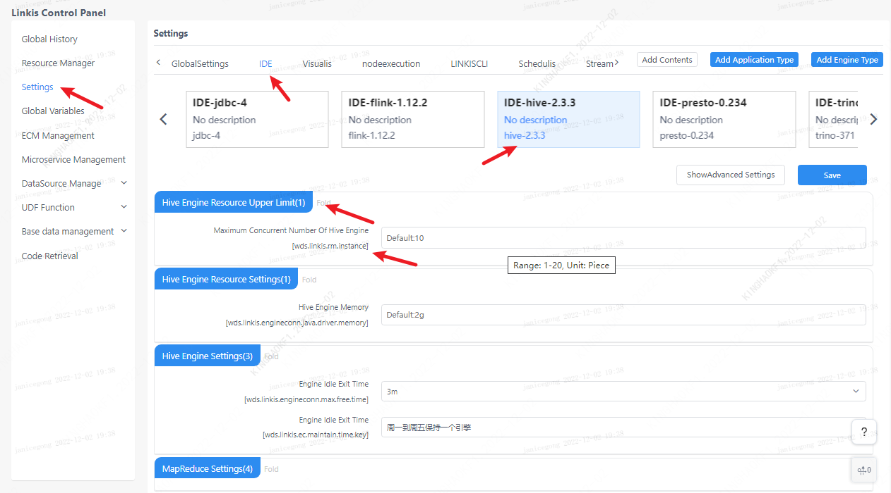

Linkis is a distributed microservice system built on Spring Cloud. The registry service uses Eureka. The microservice management interface is only visible to administrators.

## 1. Service view

The microservice management interface can view all microservice information under Linkis, and filter services by instance name and engine type keywords. And the tags under the service can be managed through the edit button.

## 2. Registry

Linkis's own microservices can be viewed by clicking on the Eureka registration center, and the microservices associated with Linkis will be listed directly on this interface.

