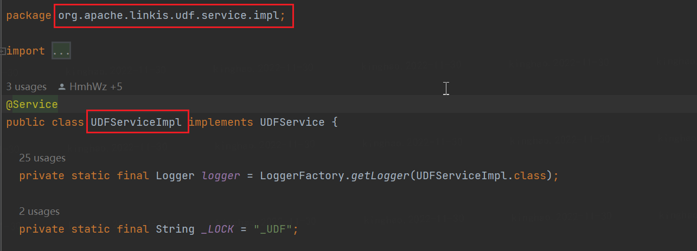

## 1 Introduction to UDF
UDF: User Defined Function, user-defined function. In some scenarios, we need to use hive functions to process some data. Functions like count() and sum() are built-in. If we want to use some functions that are not built-in, we need to customize the function, which can be done by writing UDF.

### 1.1 UDF function implementation

The way to implement a UDF is relatively simple: just inherit the UDF class and rewrite the evaluate method.  

```
public class HelloUDF extends UDF{
        public String evaluate(String str){
                try {
                        return "Hello " + str;
                } catch (Exception e) {
                        // TODO: handle exception
                        e.printStackTrace();
                        return "ERROR";
                }
        }
```


### 1.2 Several types of UDF

- UDF function (can be used only after registration):
    - UDF function of general type: refers to the UDF function that can be used by both hql of Hive and sql of Spark, and is generally compiled into a jar package
    - Spark-type UDF functions: Spark-specific UDFs need to create corresponding scala/python scripts first, register through scala or python functions, and can also be used in sql after registration

- Custom functions PythonUDF and ScalaUDF can only be used in the Spark engine
    - python function, based on functions written in python
    - Scala functions, functions written based on scala


## 2 UDF addition, deletion and modification
Click on the linkis management console: Home>>UDF Management


There are two columns of "UDF Management" and "Function Management". In the Function Management column, there are general method functions, such as python and scala functions, which can be used like ordinary functions in scripts without registration. UDF needs It can only be used after registration.


### 2.1 UDF new
Added UDF function of general type:

You need to compile the corresponding Jar package first, and upload it to the workspace of the corresponding user (if you use the dss family bucket, you can upload it through scriptis, if you use linkis separately, you need to manually upload it to the corresponding directory)


Click the Add UDF button. There are two types of UDFs that can be added. Select the "General" type and register through the jar package. The registration format needs to write the fully qualified class name of the UDF implementation class.


For example, the fully qualified class name of UDFServiceImpl in the figure below is: org.apache.linkis.udf.service.impl.UDFServiceImpl



Add the UDF function of Spark type:

If you choose the "spark" type, select the defined scala or python function to register, and you need to write a scala or python type script for the custom function. It can also be used in sql after registration, similar to: select hello("abc").

Notice:
1. When registering, you should fill in the method name in the new script.
2. After adding udf, the corresponding jar package or script content will be uploaded to bml storage. If the resource is modified locally, it needs to be updated to take effect.


### 2.2 UDF modification

Click the edit button corresponding to udf.


If you need to update the content of the udf, you need to edit the udf and upload it again, and generate a new version of the udf. If the content of the script has not changed, but only modified other content such as the format used, only the information will be updated, and no new version will be generated.


### 2.3 UDF deletion

Click the delete button corresponding to the udf. Note: all versions of the udf will be deleted.


## 3 UDF usage
If you want to make the UDF you created take effect and use it in the program, you need to load the UDF. The entry point of "loading"/"unloading" is: enter the UDF function on the left side of scriptis -> personal function, and the created UDFs are all in the personal function list.

**Note 1: If you do not actively cancel the check on the page when adding a UDF, it will be checked and loaded by default. At this time, you need to kill the corresponding engine to start a new engine, so that the operation will take effect.**

**Note 2: The operation of loading/unloading udf needs to kill the corresponding engine and start a new engine before the operation will take effect**

Introduction to non-personal functions in the list:

BDAP function: functions created by bdap for users, such as desensitization functions, etc. Note: The bdap function needs to be actively loaded before it can be used.

System function: The default function of the system can be used in the code without loading by the user.

Shared functions: functions shared to you by others, you need to load them to use them

Expired function: It is also a shared function, but the sharer marked it as expired, which will not affect the use for the time being


## 4 UDF sharing
Premise: The sharing function requires the user to be an administrator to use it, otherwise the front-end page will not provide an operation entry.

Click the share button of udf: a content box will pop up, enter the list of users you want to share (comma-separated).

Note: After being shared with others, the UDF needs to be actively loaded by others before it can be used.


After sharing, the shared user can find it in the "Shared Function", and then use it after ticking and loading it.

## 5 Other Function Introduction
### 5.1 UDF Handover

If the user resigns, it may be necessary to hand over the personal udf to others. Click the transfer button, select your transfer object, and click OK.


### 5.2 UDF expiration

For a UDF shared with others, if it has been loaded by the sharing user, the UDF cannot be deleted directly, but the UDF can only be marked as expired. For the time being, it is only used for marking and does not affect the use.

### 5.3 UDF version list

Click the "version list" button of a udf to view all versions of the udf. For each version the following features are provided:

Create a new version: copy the corresponding version to the latest version.

Download: download the udf file from bml to the local.

View source code: For python/scala script type, you can directly view the source code, jar type does not support it.

Publish: Shared udf can be clicked to release a certain version, so that the version will take effect for the shared user. Note: The shared user uses the latest version of udf, and the individual user always uses the latest version.

