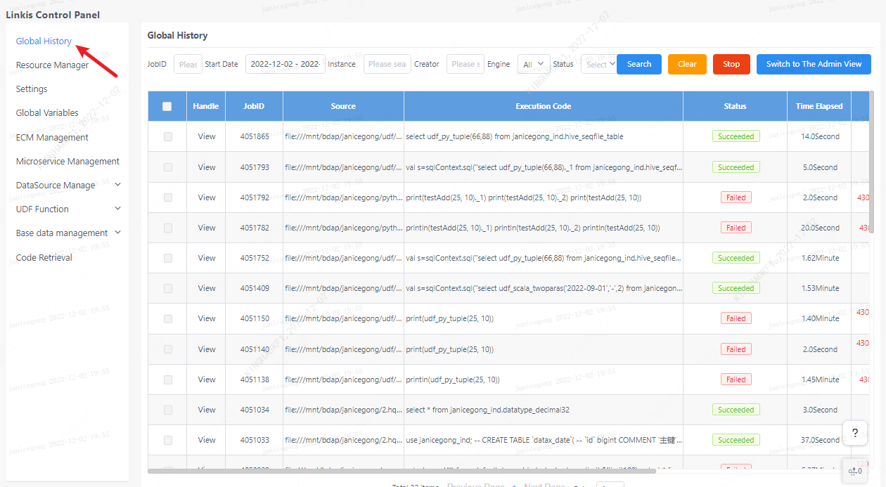
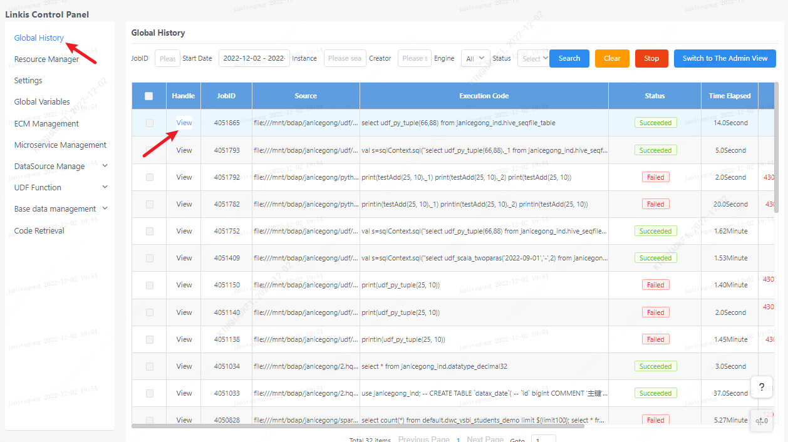
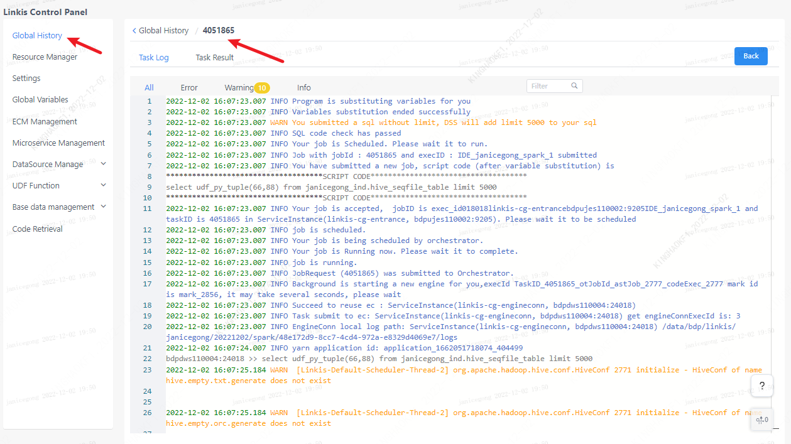
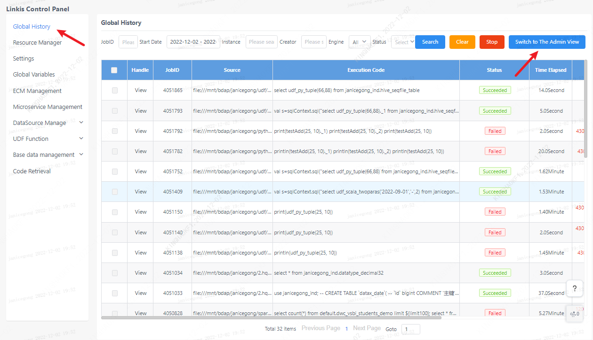

## 1. Historical tasks

The global history interface provides the user's own linkis task submission record, and the creation time, execution statement, and status of each task can be displayed here. And you can filter based on keywords such as task ID, time, engine, status, etc.

>   

## 2. Task details
Click the button on the left to view the task execution log, task details and task results. If the task execution fails, you can troubleshoot the problem through the task log.

## 3. Admin view
For linkis computing management platform administrators, administrators can view all users' historical tasks by clicking the switch administrator view on the page.

