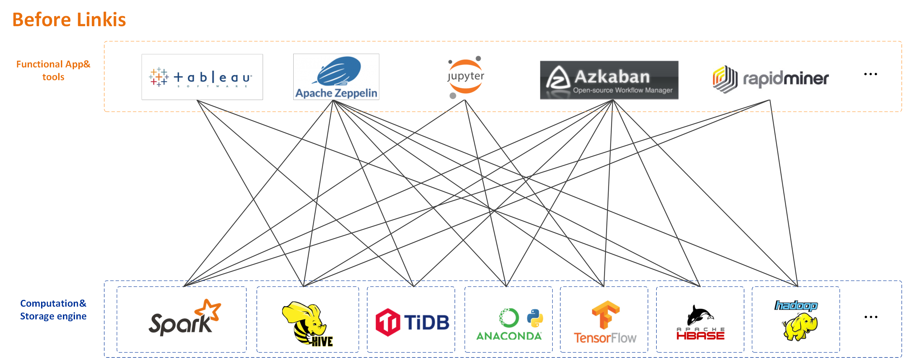
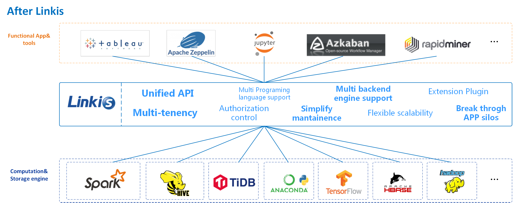

 Linkis builds a layer of computation middleware between upper applications and underlying engines. By using standard interfaces such as REST/WS/JDBC provided by Linkis, the upper applications can easily access the underlying engines such as MySQL/Spark/Hive/Presto/Flink, etc., and achieve the intercommunication of user resources like unified variables, scripts, UDFs, functions and resource files，and provides data source and metadata management services through REST standard interface. at the same time.

As a computation middleware, Linkis provides powerful connectivity, reuse, orchestration, expansion, and governance capabilities. By decoupling the application layer and the engine layer, it simplifies the complex network call relationship, and thus reduces the overall complexity and saves the development and maintenance costs as well.

Since the first release of Linkis in 2019, it has accumulated more than **700** trial companies and **1000+** sandbox trial users, which involving diverse industries, from finance, banking, tele-communication, to manufactory, internet companies and so on. Lots of companies have already used Linkis as a unified entrance for the underlying computation and storage engines of the big data platform.

## Features

- **Support for diverse underlying computation storage engines** : Spark, Hive, Python, Shell, Flink, JDBC, Pipeline, Sqoop, OpenLooKeng, Presto, ElasticSearch, Trino, SeaTunnel, etc.;

- **Support for diverse language** : SparkSQL, HiveSQL, Python, Shell, Pyspark, Scala, JSON and Java;

- **Powerful computing governance capability** : It can provide task routing, load balancing, multi-tenant, traffic control, resource control and other capabilities based on multi-level labels;

- **Support full stack computation/storage engine** : The ability to receive, execute and manage tasks and requests for various compute and storage engines, including offline batch tasks, interactive query tasks, real-time streaming tasks and data lake tasks;

- **Unified context service** : supports cross-user, system and computing engine to associate and manage user and system resource files (JAR, ZIP, Properties, etc.), result sets, parameter variables, functions, UDFs, etc., one setting, automatic reference everywhere;

- **Unified materials** : provides system and user level material management, can share and flow, share materials across users, across systems;

- **Unified data source management** : provides the ability to add, delete, check and change information of Hive, ElasticSearch, Mysql, Kafka, MongoDB and other data sources, version control, connection test, and query metadata information of corresponding data sources;

- **Error code capability** : provides error codes and solutions for common errors of tasks, which is convenient for users to locate problems by themselves;

## Supported engine types

| **Engine name** | **Support underlying component version (default dependency version)** | **Linkis Version Requirements** | **Included in Release Package By Default** | **Description** |
|:---- |:---- |:---- |:---- |:---- |
|Spark|Apache 2.0.0~2.4.7,  CDH >= 5.4.0,  (default Apache Spark 2.4.3)|\>=1.0.3|Yes|Spark EngineConn, supports SQL , Scala, Pyspark and R code|
|Hive|Apache >= 1.0.0,  CDH >= 5.4.0,  (default Apache Hive 2.3.3)|\>=1.0.3|Yes|Hive EngineConn, supports HiveQL code|
|Python|Python >= 2.6,  (default Python2*)|\>=1.0.3|Yes|Python EngineConn, supports python code|
|Shell|Bash >= 2.0|\>=1.0.3|Yes|Shell EngineConn, supports Bash shell code|
|JDBC|MySQL >= 5.0, Hive >=1.2.1,  (default Hive-jdbc 2.3.4)|\>=1.0.3|No |JDBC EngineConn, already supports Mysql,Oracle,KingBase,PostgreSQL,SqlServer,DB2,Greenplum,DM,Doris,ClickHouse,TiDB,Starrocks,GaussDB and OceanBase, can be extended quickly Support other engines with JDBC Driver package, such as SQLite|
|Flink |Flink >= 1.12.2,  (default Apache Flink 1.12.2)|\>=1.0.2|No |Flink EngineConn, supports FlinkSQL code, also supports starting a new Yarn in the form of Flink Jar Application|
|Pipeline|-|\>=1.0.2|No|Pipeline EngineConn, supports file import and export|
|openLooKeng|openLooKeng >= 1.5.0,  (default openLookEng 1.5.0)|\>=1.1.1|No|openLooKeng EngineConn, supports querying data virtualization engine with Sql openLooKeng|
|Sqoop| Sqoop >= 1.4.6,  (default Apache Sqoop 1.4.6)|\>=1.1.2|No|Sqoop EngineConn, support data migration tool Sqoop engine|
|Presto|Presto >= 0.180|\>=1.2.0|No|Presto EngineConn, supports Presto SQL code|
|ElasticSearch|ElasticSearch >=6.0|\>=1.2.0|No|ElasticSearch EngineConn, supports SQL and DSL code|
|Trino | Trino >=371 | >=1.3.1 | No |   Trino EngineConn， supports Trino SQL code |
|Seatunnel | Seatunnel >=2.1.2 | >=1.3.1 | No | Seatunnel EngineConn， supportt Seatunnel SQL code |
## Download

Please go to the [Linkis releases page](https://github.com/apache/linkis/releases) to download a compiled distribution or a source code package of Linkis.

## Compile and deploy
Please follow [Compile Guide](../development/build.md) to compile Linkis from source code.  
Please refer to [Deployment_Documents](../deployment/deploy-quick.md) to do the deployment. 

## Examples and Guidance
- [Engine Usage Guidelines](../engine-usage/overview.md)
- [API Documentation](../api/overview.md)

## Documentation

The documentation of linkis is in [Linkis-WebSite](https://github.com/apache/linkis-website)

## Architecture
Linkis services could be divided into three categories: computation governance services, public enhancement services and microservice governance services.  
- The computation governance services, support the 3 major stages of processing a task/request: submission -> preparation -> execution.
- The public enhancement services, including the material library service, context service, and data source service.
- The microservice governance services, including Spring Cloud Gateway, Eureka and Open Feign.

Below is the Linkis architecture diagram. You can find more detailed architecture docs in [Architecture](../architecture/overview.md).

Based on Linkis the computation middleware, we've built a lot of applications and tools on top of it in the big data platform suite [WeDataSphere](https://github.com/WeBankFinTech/WeDataSphere). Below are the currently available open-source projects.

- [**DataSphere Studio** - Data Application Integration& Development Framework](https://github.com/WeBankFinTech/DataSphereStudio)

- [**Scriptis** - Data Development IDE Tool](https://github.com/WeBankFinTech/Scriptis)

- [**Visualis** - Data Visualization Tool](https://github.com/WeBankFinTech/Visualis)

- [**Schedulis** - Workflow Task Scheduling Tool](https://github.com/WeBankFinTech/Schedulis)

- [**Qualitis** - Data Quality Tool](https://github.com/WeBankFinTech/Qualitis)

- [**MLLabis** - Machine Learning Notebook IDE](https://github.com/WeBankFinTech/prophecis)

More projects upcoming, please stay tuned.

## Contributing

Contributions are always welcomed, we need more contributors to build Linkis together. either code, or doc or other supports that could help the community.  
For code and documentation contributions, please follow the [contribution guide](/community/how-to-contribute).

## Contact Us

Any questions or suggestions please kindly submit an issue.  
You can scan the QR code below to join our WeChat group to get more immediate response.

Meetup videos on [Bilibili](https://space.bilibili.com/598542776?from=search&seid=14344213924133040656).

## Who is Using Linkis

We opened [an issue](https://github.com/apache/linkis/issues/23) for users to feedback and record who is using Linkis.  
Since the first release of Linkis in 2019, it has accumulated more than **700** trial companies and **1000+** sandbox trial users, which involving diverse industries, from finance, banking, tele-communication, to manufactory, internet companies and so on.