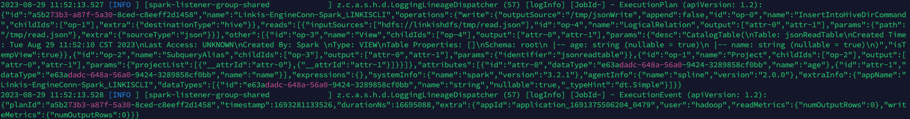
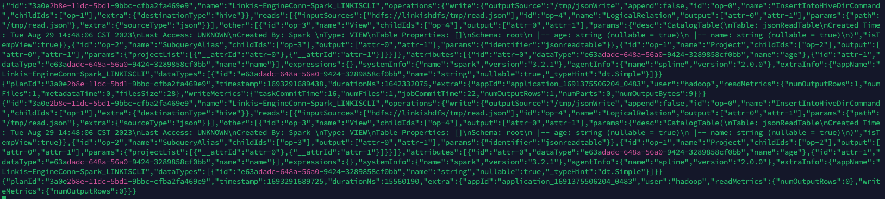

This paper mainly introduces the 'Spark' engine blood collection scheme in 'Linkis'.


## 1. Introduction

The Spline Agent for Apache Spark is a complementary module to the Spline project that captures runtime lineage information from the Apache Spark jobs.

github address
```
https://github.com/AbsaOSS/spline-spark-agent
```

## 2. Download the required jar package for `spline-spark-agent`

```shell
cd $SPARK_HOME/jars

wget https://repo1.maven.org/maven2/za/co/absa/spline/agent/spark/spark-3.2-spline-agent-bundle_2.12/2.0.0/spark-3.2-spline-agent-bundle_2.12-2.0.0.jar
```
When the download is complete, `$SPARK_HOME/jars` will appear `spark-3.2-spline-agent-bundle_2.12-2.0.0.jar`

## 3. The spark lineage collected into the log

### 3.1 Modify `spark-defaults.conf`

```shell
vim $SPARK_HOME/conf/spark-defaults.conf

Add the following configuration
spark.sql.queryExecutionListeners=za.co.absa.spline.harvester.listener.SplineQueryExecutionListener
spark.spline.lineageDispatcher=log
spark.spline.lineageDispatcher.log.level=INFO
spark.spline.lineageDispatcher.log.className=za.co.absa.spline.harvester.dispatcher.LoggingLineageDispatcher
```

### 3.2 Data preparation

```shell
Create input files and upload them to hdfs

vim read.json

{"name":"linkis","age":"5"}

hadoop fs -put read.json /tmp
````

```shell
Create output directory
hadoop fs -mkdir /tmp/jsonWrite
````

### 3.3 Submit task
```shell
sh ./bin/linkis-cli -engineType spark-3.2.1 -codeType sql -code \
"CREATE TEMPORARY VIEW jsonReadTable
USING org.apache.spark.sql.json
OPTIONS (
  path '/tmp/read.json'
);
INSERT OVERWRITE DIRECTORY '/tmp/jsonWrite' SELECT * FROM jsonReadTable;"  \
-submitUser hadoop -proxyUser hadoop
```

### 3.4 View logs
```shell
cat /appcom/tmp/hadoop/20230829/spark/117ca887-f9d6-4923-8ca1-cef7155ee0e7/logs/stdout 
```

The output is as follows:


Details are as follows:
```json
{
    "id":"a5b273b3-a87f-5a30-8ced-c8eeff2d1458",
    "name":"Linkis-EngineConn-Spark_LINKISCLI",
    "operations":{
        "write":{
            "outputSource":"/tmp/jsonWrite",
            "append":false,
            "id":"op-0",
            "name":"InsertIntoHiveDirCommand",
            "childIds":[
                "op-1"
            ],
            "extra":{
                "destinationType":"hive"
            }
        },
        "reads":[
            {
                "inputSources":[
                    "hdfs://linkishdfs/tmp/read.json"
                ],
                "id":"op-4",
                "name":"LogicalRelation",
                "output":[
                    "attr-0",
                    "attr-1"
                ],
                "params":{
                    "path":"/tmp/read.json"
                },
                "extra":{
                    "sourceType":"json"
                }
            }
        ],
        "other":[
            {
                "id":"op-3",
                "name":"View",
                "childIds":[
                    "op-4"
                ],
                "output":[
                    "attr-0",
                    "attr-1"
                ],
                "params":{
                    "desc":"CatalogTable(\nTable: jsonReadTable\nCreated Time: Tue Aug 29 11:52:10 CST 2023\nLast Access: UNKNOWN\nCreated By: Spark \nType: VIEW\nTable Properties: []\nSchema: root\n |-- age: string (nullable = true)\n |-- name: string (nullable = true)\n)",
                    "isTempView":true
                }
            },
            {
                "id":"op-2",
                "name":"SubqueryAlias",
                "childIds":[
                    "op-3"
                ],
                "output":[
                    "attr-0",
                    "attr-1"
                ],
                "params":{
                    "identifier":"jsonreadtable"
                }
            },
            {
                "id":"op-1",
                "name":"Project",
                "childIds":[
                    "op-2"
                ],
                "output":[
                    "attr-0",
                    "attr-1"
                ],
                "params":{
                    "projectList":[
                        {
                            "__attrId":"attr-0"
                        },
                        {
                            "__attrId":"attr-1"
                        }
                    ]
                }
            }
        ]
    },
    "attributes":[
        {
            "id":"attr-0",
            "dataType":"e63adadc-648a-56a0-9424-3289858cf0bb",
            "name":"age"
        },
        {
            "id":"attr-1",
            "dataType":"e63adadc-648a-56a0-9424-3289858cf0bb",
            "name":"name"
        }
    ],
    "expressions":{

    },
    "systemInfo":{
        "name":"spark",
        "version":"3.2.1"
    },
    "agentInfo":{
        "name":"spline",
        "version":"2.0.0"
    },
    "extraInfo":{
        "appName":"Linkis-EngineConn-Spark_LINKISCLI",
        "dataTypes":[
            {
                "id":"e63adadc-648a-56a0-9424-3289858cf0bb",
                "name":"string",
                "nullable":true,
                "_typeHint":"dt.Simple"
            }
        ]
    }
}
```

## 4. The spark lineage collected into the kafka

### 4.1 Modify `spark-defaults.conf`

```shell
vim $SPARK_HOME/conf/spark-defaults.conf

Add the following configuration
spark.sql.queryExecutionListeners=za.co.absa.spline.harvester.listener.SplineQueryExecutionListener
spark.spline.lineageDispatcher=kafka
spark.spline.lineageDispatcher.kafka.topic=linkis_spark_lineage_test
spark.spline.lineageDispatcher.kafka.producer.bootstrap.servers=localhost:9092
```

### 4.2 Submit task
```shell
sh ./bin/linkis-cli -engineType spark-3.2.1 -codeType sql -code \
"CREATE TEMPORARY VIEW jsonReadTable
USING org.apache.spark.sql.json
OPTIONS (
  path '/tmp/read.json'
);
INSERT OVERWRITE DIRECTORY '/tmp/jsonWrite' SELECT * FROM jsonReadTable;"  \
-submitUser hadoop -proxyUser hadoop
```

### 4.3 View topic
```shell
kafka/bin/kafka-console-consumer.sh  --topic linkis_spark_lineage_test --from-beginning --bootstrap-server localhost:9092
```

The output is as follows:


Details are as follows:
```json
{
    "id":"3a0e2b8e-11dc-5bd1-9bbc-cfba2fa469e9",
    "name":"Linkis-EngineConn-Spark_LINKISCLI",
    "operations":{
        "write":{
            "outputSource":"/tmp/jsonWrite",
            "append":false,
            "id":"op-0",
            "name":"InsertIntoHiveDirCommand",
            "childIds":[
                "op-1"
            ],
            "extra":{
                "destinationType":"hive"
            }
        },
        "reads":[
            {
                "inputSources":[
                    "hdfs://linkishdfs/tmp/read.json"
                ],
                "id":"op-4",
                "name":"LogicalRelation",
                "output":[
                    "attr-0",
                    "attr-1"
                ],
                "params":{
                    "path":"/tmp/read.json"
                },
                "extra":{
                    "sourceType":"json"
                }
            }
        ],
        "other":[
            {
                "id":"op-3",
                "name":"View",
                "childIds":[
                    "op-4"
                ],
                "output":[
                    "attr-0",
                    "attr-1"
                ],
                "params":{
                    "desc":"CatalogTable(\nTable: jsonReadTable\nCreated Time: Tue Aug 29 14:48:06 CST 2023\nLast Access: UNKNOWN\nCreated By: Spark \nType: VIEW\nTable Properties: []\nSchema: root\n |-- age: string (nullable = true)\n |-- name: string (nullable = true)\n)",
                    "isTempView":true
                }
            },
            {
                "id":"op-2",
                "name":"SubqueryAlias",
                "childIds":[
                    "op-3"
                ],
                "output":[
                    "attr-0",
                    "attr-1"
                ],
                "params":{
                    "identifier":"jsonreadtable"
                }
            },
            {
                "id":"op-1",
                "name":"Project",
                "childIds":[
                    "op-2"
                ],
                "output":[
                    "attr-0",
                    "attr-1"
                ],
                "params":{
                    "projectList":[
                        {
                            "__attrId":"attr-0"
                        },
                        {
                            "__attrId":"attr-1"
                        }
                    ]
                }
            }
        ]
    },
    "attributes":[
        {
            "id":"attr-0",
            "dataType":"e63adadc-648a-56a0-9424-3289858cf0bb",
            "name":"age"
        },
        {
            "id":"attr-1",
            "dataType":"e63adadc-648a-56a0-9424-3289858cf0bb",
            "name":"name"
        }
    ],
    "expressions":{

    },
    "systemInfo":{
        "name":"spark",
        "version":"3.2.1"
    },
    "agentInfo":{
        "name":"spline",
        "version":"2.0.0"
    },
    "extraInfo":{
        "appName":"Linkis-EngineConn-Spark_LINKISCLI",
        "dataTypes":[
            {
                "id":"e63adadc-648a-56a0-9424-3289858cf0bb",
                "name":"string",
                "nullable":true,
                "_typeHint":"dt.Simple"
            }
        ]
    }
}
```

## 5. More ways

```text
`spline-spark-agent` also supports more collection modes, such as Http and Console. For details, see the official documentation
https://github.com/AbsaOSS/spline-spark-agent/#configuration
```
